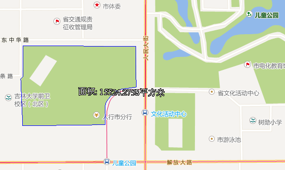
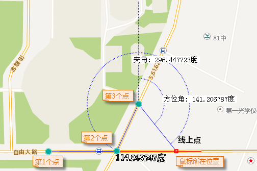
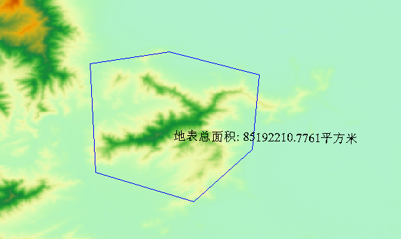
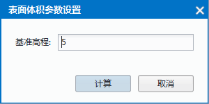

　　Measure distances, areas and angles on a map. You can redo the previous operations by the usage of Ctrl+Z.

　　Before doing the measurement operation, you should define the unit. Click "Unit" in the "Operation" group on the Map menu to open the dialog box "Measurement Settings" in where you can set the units of distances, areas, angles.

### Distance Measure

　　1.  Click "Map" and on the group "Operations" click "Map Measure", then select "Distance Measure" from the list.

　　2.  When the shape of the mouse pointer turn to a cross wire, click the left key of it at the starting point and then move the mouse, meanwhile there is a constantly changing line appearing in the screen with the distance value.

　　3.  Thera are two values displaying on the map during the operation, one is the distance between the current mouse position and last point, another one is the sum of the distances of all lines. The two values are the same when the first point has been confirmed but the second point has not been confirmed.

　　4.  You can click a series of points to continuously measure distances.

　　5.  The distance measurement will be finished when you click the right key of your mouse, while every distance will be labeled beside the corresponding line, the total distance will be output to the Output Window.

　　6.  You can clear the result from the current map window by clicking "Clear" button in the Operation group on the "Map" menu or pressing "ESC" key.

　　

### Area Measure

　　1. In the "Map" menu and on the group "Operations" click "Map Measure", then select "Area Measure" from the list.
 
　　2. When the shape of the mouse pointer turn to a cross wire, click to specify the first point of the temporary polygon for measuring distance. Click again to form the first edge of the polygon. When you move the mouse pointer from the second point, the area of the temporary polygon is displayed on the map when you move the mouse pointer.

　　3. Continuously click to define the polygon for polygon for measuring distance.
 
　　4. Right click to finish measuring area. The area of the temporary polygon is displayed on the map as well as in the Output Window.

　　5. To clear the polygon and the area label, click the Clear button in the Operation group. Besides, you can press Esc to implement the clear operation.

　　

### Angle Measurement

　　1.  In the "Map" menu and on the group "Operations" click "Map Measure", then select "Angle Measure" from the list.

　　2.  When the shape of the mouse pointer turn to a cross wire, click to specify the start point of one edge, a dotted line pointing to true north shows up. Move the mouse pointer to form the edge, the included angle between the dotted line pointing to true north and the edge, also called the azimuth of the edge, is displayed.

　　3.  Click again to confirm the first edge, continue to move the mouse to specify the other edge. The azimuth of the second edge and the angle between the two edges are displayed on the map.

　　4.  Continuously click mouse to measure included angles between edges and azimuths for all edges.

　　5.  Right click to finish measuring angles. Angles for each pair of connected edge are displayed around the junctions as well as in the Output Window. Also displayed in the Output window is the included angles of each edge.

　　6.  You can clear the result from the current map window by clicking "Clear" button in the Operation group on the "Map" menu or pressing "ESC" key.

　　
  
### 地表距离   
  
地表距离量算是用来量算栅格数据中的表面距离，即量算在栅格数据集拟合的三维曲面上沿指定的线段或折线段的曲面距离。地表距离所量算的距离是曲面上的，因而要比平面上的值要大。

操作步骤  
1. 在地图窗口中打开要进行地表距离量算的栅格数据集。注意：当前工作空间中，如果不存在打开的栅格数据时，该功能不能使用。   
2. 在“**地图**”选项卡的“**操作**”组中，单击“**地图量算**”下拉按钮选择“**地表距离**”，则当前地图窗口的操作状态变为地表距离量算状态。  
3. 在地图窗口中待量算距离的起点位置单击鼠标左键，确定量算距离的起点；移动鼠标，屏幕上会出现连接鼠标当前点和起点的一条长度不断变化的临时线段，同时还显示了这条线段的距离值。  
4. 量算过程中，地图窗口会同时显示两个结果数值：当前鼠标点与前一点之间的线段长度和当前鼠标点与量算距离的起点间折线段的总长度。在鼠标单击第二个点之前，地图窗口中显示的这两个数值相等；当鼠标单击第二个点后，移动鼠标，地图窗口中显示的两个数值发生变化，当前鼠标点与前一点之间的线段长度始终小于当前鼠标点与起点间折线段的总长度。  
5. 用户可以单击一系列的点来连续进行距离量算，不仅可以获得当前两点间的距离，还可以获得总距离。   
6. 单击鼠标右键即可结束地表距离量算，同时整条折线段的相应位置出现各条线段的数值注记，输出窗口中也显示出整条折线段的总距离值。  
7. 单击“**操作**”组中的“**清除**”项，即可清除当前地图窗口中临时折线和长度量算的数值注记。此外，按 `Esc` 键也可实现“清除”功能。  
8. 应用程序会在地图窗口和输出窗口显示分析的表面距离大小。 
 
  
　  
  
### 地表面积  
  
地表面积用来量算栅格表面面积，即量算所绘临时多边形区域内的栅格数据集拟合的曲面的总的表面面积。  
    
操作步骤  
1. 在地图窗口中打开要进行地表面积量算的栅格数据集。注意：当前工作空间中，如果不存在打开的栅格数据时，该功能不能使用。   
2. 在“**地图**”选项卡的“**操作**”组中，单击“**地图量算**”下拉按钮选择“**地表面积**”，则当前地图窗口的操作状态变为地表距离量算状态。  
3. 在当前地图窗口中绘制一个多边形，单击鼠标右键，完成操作。应用程序会在地图窗口以及输出窗口显示分析的临时多边形栅格表面的面积大小。默认的面积单位为平方米。按住 Esc 键可以清除地图窗口中绘制的临时多边形。   
4. 应用程序会在地图窗口和输出窗口显示分析的地表面积大小。 

  
　    
  
### 地表体积  
  
地表体积用来量算栅格地表体积，即量算所选多边形区域内的栅格数据集拟合的三维曲面与一个基准平面之间的空间上的体积。
  
    
操作步骤  
1. 在地图窗口中打开要进行地表距离量算的栅格数据集。注意：当前工作空间中，如果不存在打开的栅格数据时，该功能不能使用。   
2. 在“**地图**”选项卡的“**操作**”组中，单击“**地图量算**”下拉按钮选择“**地表体积**”，则当前地图窗口的操作状态变为地表距离量算状态。  
3. 在当前地图窗口中绘制一个多边形，单击鼠标右键，此时弹出“表面体积参数设置”对话框。 在对话框中输入基准高程。其中基准高程为量算表面体积的起始高度。 单击“计算”按钮，计算临时绘制的多边形覆盖的体积。 
    
　      
4. 应用程序会在地图窗口和输出窗口显示分析的地表体积大小，默认的体积单位为立方米。

  
