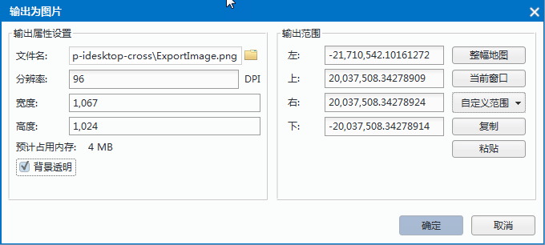
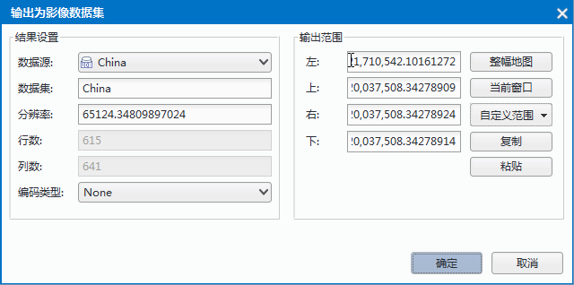

  
You can export your map as a picture or an image dataset.
  
### Output Map 

"Export Picture" command is used to export the current map as a picture. The supportive image formats contain: *.bmp, *.jpg, *.png, *.gif, *.eps, *.tif.
  
**Basic Steps**  
  
1. Make sure that there are not any selected objects. Right click your mouse in the map window, then select "Export to Picture" and the dialog box "Output Picture" appears.
　　      
2. There are some parameters you can set. Following contents explain the detail information of these parameters.
  + File Name: Click the folder image button at right and in the pop-up "Save" dialog box, set up the path and name for the picture.
  + Resolution: The resolution of picture. Currently, you are allowed to set the resolution for the picture in *.bmp, *.jpg, *.png, or *.tif format. The default is 96. Its unit is DPI.
  + Width: Set up the width of picture and its unit is pixel.
  + Height: Set up the height of picture and its unit is pixel.
  + Predicted Memory Size: According to the resolution, height and width of picture, estimate the size of picture.
  + Transparency: When the format of picture is png or gif, you can check the check box to set the background of picture is transparent.
3. Export Bounds: Set which contents in the map will be exported as a picture. Four setting methods are provided.
  +  Entire Map:  Click Entire Map, you can set the union of all layer range in the current map to the output range. 
  +  Current Window:  Click Current Window, you can set the map range of current window to output range. 
  +  Custom Bounds: You can specify which objects you want to exported through selecting them. Or you can draw a rectangle and then the contents within the rectangle will be exported.
4. Click "OK".
  
**Note**  
When exporting a map to a picture, the "Flow Display" and "Avoid Overlap" of thematic maps are disabled and will be closed automatically. 
     
### Save as Image Dataset 
  
Save your map to an image dataset.

**Basic Steps**  

1. Right click your mouse in the map window and then select "Save as Image Dataset" to open the "Save as Image Dataset" dialog box.

　　         
2. Set parameters on the result dataset: Datasource where the result dataset will be saved into and the dataset's name. Set the image resolution and the row number and the column number will be calculated out automatically. Set the Encode Type including DCT, LZW, PNG and None. For more contents on Encode Type, please refer to Dataset Encoding Types. 
3. Select Export Bounds. The export bounds can be the whole map, the contents shown only in the current window, or you can select export bounds with your mouse.
4. Click "OK".
 
**Note**  
You should adjust the image resolution appropriately in case your disk is out of space.
