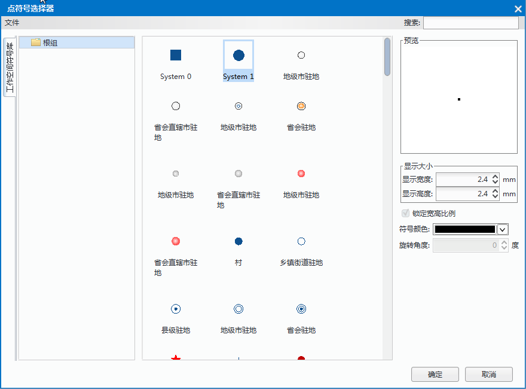
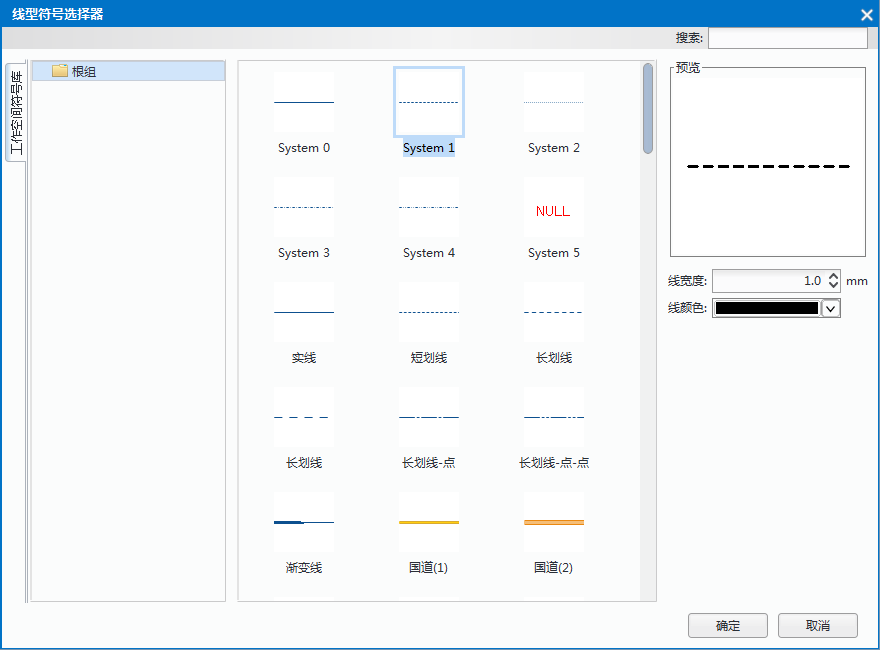
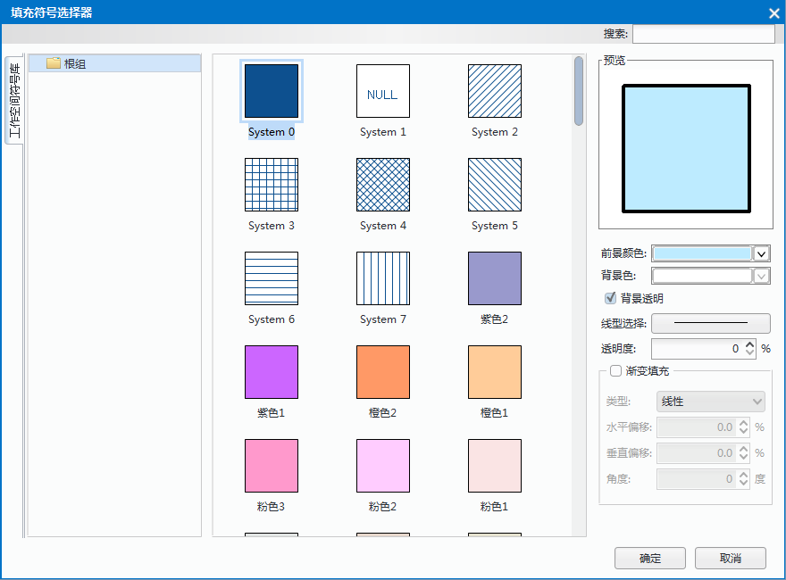

　　All kinds of symbols are organized and managed through symbol libraries in SuperMap. Three types of symbols corresponds with three symbol libraries including: Marker symbol library, Line symbol library and Fill symbol library.
　　The application manages all kind of symbol libraries through symbol library windows, thereby managing symbols in libraries. However, only one type of library and symbols in the library can be managed in a symbol library window currently.

### How to open symbol library windows 
  
The Symbol Library Window appears in two forms: the Symbol Library window and Style Settings window. The former is mainly used to load, browse, manage symbol library files. Besides those functions, the Style Setting window can also be used for setting the symbol styles. The operations in the two windows are the same.

You can open symbol libraries as following ways:
  
1. **Through the Workspace Manager**: In the Workspace Manager, double-click the Resources node to display the child nodes: Marker Symbol Library, Line Symbol Library, and Fill Symbol Library.
  
	+ Right click the "Marker Symbol Library" and select "Load Point Symbol Library", then a symbol library predefined by system is opened.
	+ Right click the "Line Symbol Library" and select "Load Line Symbol Library", then a line symbol library predefined by system is opened.
	+ Right click the "Fill Symbol Library" and select "Load Fill Symbol Library", then a fill symbol library predefined by system is opened.

2. **Through the Layer Manager**: In the Layer Manager, double click a symbol icon of layer to open the corresponding symbol library.
  
	+ Double click the point symbol icon to open the "Marker Symbol Selector". The default library is provided by system.
	+ Double click the line symbol icon to open the "Line Symbol Selector". The default library is provided by system.
	+ Double click the region symbol icon to open the "Fill Symbol Selector". The default library is provided by system.
	  
3. **Through "Layer Style" button**: In the ribbon area, click "Style Settings" > Style group > Layer Style to open the relative symbol selector.
  
### The style settings of marker symbols
 
　　  

1. Select a marker symbol: In the symbol library window, select the symbol you need.
2. Set the display style: You can preview the symbol style in the Preview area.
3. The symbol style can be set according to following parameters: 
   
 + Display Size: Set the symbol size.
	+ Display Width: Set the symbol width. You can enter a value directly or click the two arrows to adjust the symbol width. Unit: 0.1mm.
	+ Display Height: Set the symbol height. You can enter a value directly or click the two arrows to adjust the symbol width. Unit: 0.1mm.
	+ Lock Aspect Ratio: Set whether the percentage between symbol height and symbol width is certain. It is checked by default, that means when you modify one of them, another one will be changed too. Note: The feature is worked only for raster symbols. For vector symbols, the percentage is certain whether you check the check box or not.
	+ Rotation: Set the rotation of symbol. You can enter a value directly or click the two arrows to adjust the rotation. When the value is positive, the symbol will be rotated anticlockwise. In contrast, it will be rotated clockwise.
	+ Color: Set the symbol color. Click the drop-down button and in the pop-up color panel, you can select any color you want, or you can click "Other Color" to get more colors.
  
4. Click "OK".
  
### The style settings of line symbols
 
　　    

1. Select a line symbol: In the symbol library window, select the symbol you need.
2. Set the display style: You can preview the symbol style in the Preview area. 
3. The line symbol style can be set according to following parameters: 
  
	+ Width: Set the line width. You can enter a value directly or click the two arrows to adjust the symbol width.
	+ Line Color: Set the line symbol color. Click the drop-down button and in the pop-up color panel, you can select any color you want, or you can click "Other Color" to get more colors.
  
4. Click "OK" button to apply to the settings.
  
### Fill Color Scheme  
  
　　  
      
1. Select a fill symbol: In the symbol library window, select the symbol you need.
2. Set the display style: You can preview the symbol style in the Preview area. 
3. The fill symbol style can be set according to following parameters: 
   
	+ Foreground: Set the color of the filled content, click the drop-down button at right to open the color panel where you can choose a color from or click "Other Color" at the bottom of the color panel to get more custom color.
	+ Background: Set the color of the unfilled content, click the drop-down button at right to open the color panel where you can choose a color from or click "Other Color" at the bottom of the color panel to get more custom color.
	+ Transparency: Check the check-box to set the unfilled content transparency, meanwhile the setting of the background color is invalid.
	+ Line Symbol: Set the boundary style of filled symbol. Click the button at right of the label to open the Line Symbol Selector for you to set the boundary style.
	+ Transparency: Set the transparency effect of the filled content. You can enter a value into the text box directly, also you can adjust the transparency by clicking the up/down arrows at right. The value is an integer from 0 to 100, 0 means opaque, 100 represents completely transparent.
	+ Gradient Fill: Check the check-box to take a color gradient (changing from the foreground color to the background color) as the filled content.
	+ Other parameters: If you check the "Gradient Fill", other parameters can be set.
		+ Type: The ways of how to produce a color gradient.   
		  
　　1. Linear: The type of gradient is a linear gradient.
　　2. Radial: The type of gradient is a radial gradient, the change in the colors radiating outwards from the center.
　　3. Square: The shape of the gradient is square.
　　       
	  
   - Rotation: Set the rotation angle for color gradient.

   - Offset X: Set the offset percent in the horizontal direction that the center of color gradient is relative to the center of filled range. You can enter a value into the text box directly, also you can adjust the value by clicking the up/down arrows at right.

   - Offset Y: Set the offset percent in the vertical direction that the center of color gradient is relative to the center of filled range. You can enter a value into the text box directly, also you can adjust the value by clicking the up/down arrows at right.

4. After all, click "OK" to apply to these settings.

