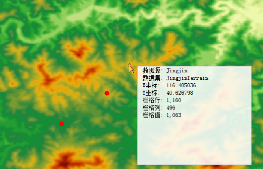

　　Pixel is a basic information storage unit, and each pixel has a given value to indicate a geography entity or one kind of phenomenon in reality. Raster data has a certain spatial resolution, and one pixel represents a certain area, hence each pixel value represents the main feature or phenomenon in its corresponding area. The spectrum of satellite image reflects the reflectivity of light in a band. The pixel values of DEM can indicates surface elevation, precipitation, pollutant concentration, distance and so on. The "Raster Query" feature can make you know about the coordinate values, column/row number, raster value of a pixel.

### Basic Steps

　　1.  Open your raster dataset, and click "Spatial Analysis" > "Raster Analysis" > "Raster Query".

　　2.  Move your mouse in the raster window, and during the procedure of mouse movement, you can see a message box with some information on the pixel where your mouse is located in.

　　

　　3.  Left click the point whose raster value you want to search to highlight it, meanwhile its geography coordinates, raster coordinates and raster value will be output in the Output Window.

　　4.  Press ESC key or right-click your mouse to cancel the operation, all highlighted points will be cleared after you press ESC key.

