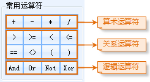
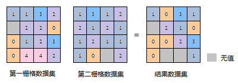

  
### Instructions  

　　Perform the arithmetical operation or functional operation on one or more raster datasets. The pixel values of resulting raster data are obtained through calculating the pixel values of input raster data at the same positions.

　　Raster algebraic operations have a wide usage and can give us assists in resolving various reality problems. Such as, you can subtract the original DEM raster the constructed DEM raster from each other, and then you can obtain the elevation difference thereby acquire the fill volume and cut volume of your project. Also you can get the areas where the annual rainfall is between 20 mm and 50 mm through executing the expression "20 < rainfall < 50" to the raster data on annual rainfall.

　　SuperMap provides abundant operators, functions and expressions. Besides common arithmetical operations (addition, subtraction, multiplication, and division), you are allowed to customize expressions to realize variety needs on raster analysis.

### Basic steps

1. In the toolbox, click "Data Processing" > "Raster" > "Algebraic Operation", then in the pop-up dialog, set up the operation parameters and analysis environment.
2. **Algebraic Operation Expression**: All expressions you entered will be shown in the area. Click "Set Operation Expression", and then enter algebraic operations in the pop-up dialog box "Raster Algebraic Operation". 
  
	- In the list box at the right of the box, all datasources and raster datasets in the current workspace are listed, then click the dataset which you want to operate on.
	- The expressions of different types (include dataset, figure, constant, operator and function) that make up the algebraic operation expression will be displayed in the expression box with different font-styles. Beside, in the expression box, click the right mouse button to select related editable options ("cut", "copy", "paste", "delete") which edit the expression. You can also use the Windows shortcut key to edit. (such as Ctrl+X, Ctrl+C, Ctrl+V, Delete and so on). When edit the algebraic operation expression, it is recommended that edit an expression as a whole, and it can save the special font style.    
	 
	**Note**: the composition of algebraic operation expression should follow following rules: 
	- When the reference dataset is the operation data, the format is [Datasource name, Dataset name]. For example, the reference data of dataset BeijingTerrain in datasource Jingjin is: [Jingjin. BeijingTerrain]. 
	- The operand of arithmetic operator can be a dataset, figure or constant (the result of a functional operation). 
	- The argument of a math function can be a numerical value, a dataset, or the operation expression of one or more datasets. 
	- When the operand is negative, you should add the (). 
	- The expression should contain least an input raster dataset. 
	    
3. **Common Functions **: In addition to the commonly used operators, SuperMap also provides 21 kinds of commonly used functions, including arithmetic functions, trigonometric functions, exponential/logarithmic functions and other functions. The following contents will introduce the contents of all kinds of functions in detail.

- **Arithmetic functions**     

Function|Illustration  
-|-  
abs(x)|The absolute value.  
mod(x, y)|The modulo function, namely, get the remainder of x/y. The output value is integral value. When the y > X, mod(x, y) = x.
floor(x)|The rounding down function, namely, get the closest smaller integer to x. The output value is floating point.
	
- **Trigonometric functions**   
 
Function|Illustration  
-|-  
sin(x)|The sine function  
cos(x)|The cosine function
tan(x)|The tangent function  
cot(x)|The cotangent function
asin(x)|The arc-sin function
acos(x)|The arc-cosine function
atan(x)|The arc-tangent function
acot(x)|The arc-cotangent function  
sinh(x)|The hyperbolic sine function  
cosh(x)|The hyperbolic cosine function  
tanh(x)|The hyperbolic tangent function   
	
- **Exponential/Logarithmic functions**    

Function|Illustration 
-|-  
exp(x)|The function that the power is natural logarithm e.
pow(x, y)|pow(x, y)
sqrt(x)|sqrt(x)  
ln(x)|Get the natural logarithm
log(x)|log(x)
  	
- **Other functions**    

Function|Illustration 
-|-  
Con(x, y, z))|The condition determine function. The x is the condition express (or the value) and y, z are the extraction values. If the function meets the conditions x. extract y; Otherwise, z.
pick(n1,n2,n3,...,nn)|Check whether the expression contains none. If the x is null (none), return 1; otherwise, return 0.
  
4.**Common operators**: SuperMap provides the common operators, as shown below, including basic arithmetic operators, relation operators and logical operators. Click the button to display the corresponding operators to the expression dialog box. 
　　     

5.**Arithmetic Operation**: The common arithmetic operations have: addition (+), subtraction (-), multiplication (*) and division (/). The following table introduces how to use these operators in the raster algebraic operation in detail.
	  
- **Addition**: The addition in raster algebraic operation is a processing that makes the cell values in the two input raster datasets add one by one. 
	    
- **Subtraction**: The subtraction is used to subtract one raster dataset from another one, namely, the pixel value in first raster dataset minus the cell value in the corresponding location of last one. Because of the orders entering raster datasets are different, the results will be different generally.
	 
- **Multiplication**: The multiplication in raster algebraic operation is a processing that makes the cell values in the two input raster datasets multiply one by one. 
	    
- **Division**: The division in raster algebraic operation is a processing that makes the cell values in the two input raster datasets divide one by one.
	   
  
6.**Logical Operation**: The logical operation, also known as bool operation, determines the "true" or "false" for the cell values of inputting raster dataset, and output them in the format of (1,0). The results are represented by 1 or 0. 1 means "true", namely meets the raster pixels of the algebraic operation expression; 0 represents "false" in logical, and means don't meet the raster pixels of the algebraic operation expression.
The common logical operations include And, Or, Not and Xor. The following contents introduce the methods of logical operations in detail.

- **And**: It means "And", represented by &. If and only if the raster dataset meets two algebraic operations, the pixel value is true and be assigned 1; Otherwise, false and 0. 
- **Or**: It means logical "or", represented by |. When the cell value of raster dataset meets one of the two algebraic operations, the cell value is true, assigned 1. If the cell value of raster dataset doesn't meet the two algebraic operations, the cell value is false, assigned 0. 
- **Not**: It means logical "Not", represented by Not( ). If the value of raster dataset doesn't meet two algebraic operations, the pixel value is true and be assigned 1; Otherwise, false and 0.  
- **Xor**: It means logical "Xor", represented by ^. If and only if the cell value of raster dataset meets one of the two algebraic operations, the cell value is true, assigned 1; If the cell value of raster dataset meet the two algebraic operations, the cell value is false, assigned 0.  
	
7.**Import/Export...**: You can set the parameters of "Raster Algebraic Operation" through the "Import.../Export..." buttons on the bottom left. 
- **Import...**: Click it and then import the algebraic operation configuration file in *.xml format into the dialog box.
- **Export...**: Click it and you can export the expressions and other related parameters into a file in *.xml format.
   
8.**Result data settings**     
 
- **Pixel Format**: Set the pixel format of the result dataset. The application provides 1 bit, 4 bit, single byte, double byte, integer, Long, single-precision and double-precision.
- **Compress Dataset**: Check it and the system will compress the result datasets, otherwise it doesn't compress storage. 
- **Ignore NoValue Cells**: After check this box, the NoValue pixels in raster dataset won't attend the algebraic operation. The corresponding cell value in result dataset is NoValue too (usually it is -9999). But if you don't check this box, the system will make the no value pixels attend the algebraic operation, which will make the minimum value or maximum value of result raster dataset changed. 
  
9.**Environment**: Set the environment for the raster analysis.
	  
- **Result Bounds**: You can specify a range for the raster analysis, and then only the pixels within the range will be analyzed, also the range is the geographic range of the result dataset. Four setting ways are provided: Intersection of all datasets, Union of all dataset, Custom bounds, and Use the range of specified dataset.
- **Effective Analysis Area**: You can specify a region dataset as the effective area for raster analysis and all pixels in the area will be involved in the analysis, the pixels out of the range will not take part in the analysis and be assigned the value of NoValue in the result dataset.
-  **Default Cell Size**: Specify the resolution adopted in the result dataset. The value can be set as any value, also you can set the value through other ways. 
	- **Min Resolution of All Datasets**: Take the minimum resolution from all the datasets as the resolution of result dataset.  
	- **Max Resolution of All Datasets**: Take the maximum resolution from all the datasets as the resolution of result dataset.  
	- Specify the resolution of a reference dataset as the output resolution.
	- **Custom Resolution**: Enter the defined resolution as the output resolution.
 
10.Click "Run" image button to perform the operation.

 

