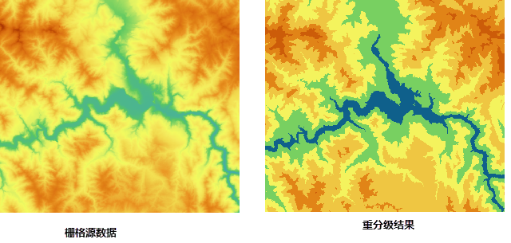

  
### Instructions  

　　Redefine the value of each pixel in a raster dataset. The function only is available for raster datasets (GRID) but image datasets (IMAGE).

　　Reclassify the cell values of the source raster data and assign them according to the new classification criterion. The pixel values will be replaced by the new pixel values. Reclassify is necessary when you want to find out the laws of known data which can give you assists for further analysis. Reclassify includes four forms:
  
- Replace the original values with new values. Such as the cultivated land which was wasteland before can be assigned a new value.
- Regroup cells. The cells in the same group are given the same value to simplify data. Such as the dry land, irrigable land and cultivated land can be taken as agricultural land. 
- Reclassify varieties of raster data as a unified standard. Such as the influenced factors of building site include soil and slope. You can reclassify the soil and slope datasets according to 1-10 ranks, which is easy to further location analysis. 
- Specify some cells which will not participate in the analysis as NoValue. You can also assign new values to the NoValue cells.

### Basic steps

1. In the toolbox, click "Data Processing" > "Raster" > "Raster Reclassify" to open the "Raster Reclassify" dialog box.
2. Specify the dataset which will be reclassified.
3. In the "Parameter Settings" area, all ranges (10 by default) of values are listed.
	-  "**From**": The range after classified the cell value of raster dataset is from the value. 
	-  "**To**": The range after classified the cell value of raster dataset is to the value. 
	-  "**Target Value**"：The new cell value assigned to the source cell value in the classification range. 
4.  Click "Level Settings" image button to open the "Level Settings" dialog box.
	- **Interval**: Determine every range of values according to the interval value. According to the interval and given the minimum value of raster, all ranges will be calculated out, and the upper limit of the last range will less than or equal the maximum value of raster. Such as, the maximum raster value is 1000, and the minimum value is 200, if you set the Interval as 200, the range values will be 200, 400, 600, 800, 1000. But if you set the interval as 300, the range values will be 200, 500, 800.
	- **Ranges**: Determine how many levels your raster data will be reclassified. 10 is by default. According to the maximum value and minimum value of raster data, the system will calculate out every range. Such as, the maximum raster value is 1000, and the minimum value is 200, if you set the ranges as 4, the range values should be 200, 400, 600, 800, 1000.
5. **Pixel Format**: Set the pixel format of the result dataset. The system provides integer, long integer, single precision float and double precision float. See Pixel Type of Grid Dataset for more information about pixel formats. 

6. **Range**: Close means the end of a range is inclusive, and Open means the end of a range is exclusive.
	- **Left Close Right Open**: The lower end of each range is inclusive, and the higher end is exclusive.
	- **Left Open Right Close**: The lower end of each range is exclusive, and the higher end is inclusive.
7. Settings of special pixels
	- **NoValue**: You can specify a new value for the original NoValue pixels or just keep them NoValue.
	- **Unrated Units**: You can set a new pixel value for the pixels without all ranges reclassified.

8. Specify a name for result dataset and a datasource to save the result dataset. Click "Run" image button to perform the operation. 
  
**Instance** As the following pictures show, reclassify the left raster data. Set the pixel format as integer and ranges as 10, then select "Left Close Right Open" without checking "NoValue" and "Unrated Units". After the Reclassify operation, result the right raster dataset.

　　  

