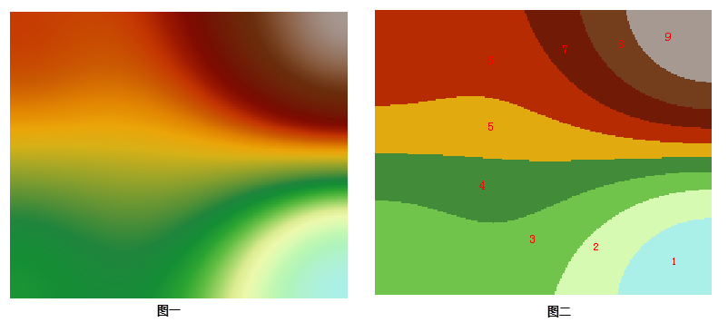

  
### Instructions  

　　Split Raster divides your raster data into several group according to discontinuity points. This method is based on the existed groups in the input data and the breaks where the values changed sharply in the output dataset are uneven. Hence, this method results in between every group the difference is the greatest. 
　　This method is appropriate for raster data whose value distributions are uneven.
   As the following picture shows, set the group number as 9, and the minimum value as 1 to reclassify the figure 1. The operation result is shown in the figure 2.   
       　

### Basic steps

1. In the toolbox, click "Data Processing" > "Raster" > "Split Raster" to open the "Split Raster" dialog box.
2. Specify the dataset which will be split.
3. **Classes**: Specify the number of groups. 10 is by default. 
4. **Minimum**: Specify the value of raster in the first level. Based on the value, gradually add 1 as new values of other raster groups.
5. Set a name for result dataset and specify a datasource to save the dataset. Click "Run" image button to perform the operation.

