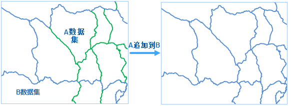

　　Append data from one or more datasets into a target dataset. Applicable types of datasets contain: point, line, region, text, CAD, model, attribute table.

　　The field names and field types in the source dataset and in the target dataset must be the same. 

### Basic Steps

 1. In the toolbox, click "Data Processing" > "Vector" > "Append Row" to open the "Append Row" dialog box.
 2. Specify an existed dataset in the Target Data region to append, or just create a new dataset.
 3. Select one or more source datasets by clicking "Add" image button in the Source Data list. The datasets in the list box can be edited with the tool bar button. 
 4. "Save New Fields": Set whether to retain the fields that exist in the source data but not in the target data. For instance, target dataset NewDataset1 has a field F1, and the source dataset NewDataset2 has a field F2, other field names are all the same. If you choose to save new fields, the result is that the target dataset contains F1 and F2; if you do not select this option, the target dataset will only contain F1. 
 5. Click "Run" image button to execute the operation.

  

### Note

  - When the target dataset is a CAD dataset, the source dataset can be a point/line/region/text/CAD dataset; when the target dataset is a tabular dataset, the source dataset can be any kinds of vector datasets; when the target dataset is of other types, the source dataset must belong to the same type. 
  - The geometry object in the source dataset will also be appended to the target dataset. 
  - For SQLPlus datasource, if the target dataset contains data and has a tile index, it is recommended to delete the tile index and create a new one after the operation. 

### Related topics

 [Dissolve](Datafuse.html)

