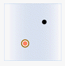
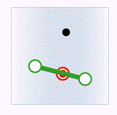
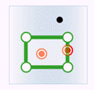
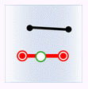
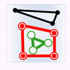
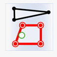
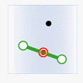
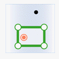

　　Update object attributes in datasets according to spatial relationships.

### Instructions

　　Spatial relationship is the relation between geometry objects which will provide attributes and target objects, there are three relations "Contain", "Within" and "Intersect". 

 - **Contain**: Objects which provide attributes contain the target objects. If the object A contains the target object B, the attributes of B will be replaced with the attribute of A. As following pictures show, the green objects provide attributes, the red parts is the target objects meeting the relation. The black parts is in contrast to the red objects.

 Objects           | Target points            |  Target lines          |  Target regions          
 :-------------- | :--------------- | :--------------- | :---------------
 Points which provides attributes  |    | None |None 
 Lines which provides attributes  |    |  |None 
 Regions which provides attributes  |    |  | 
 
 - **Within**: The target objects contain objects in the dataset which is used to provide attributes. If the target object B contains the object A, the attributes of B will be replaced with the attribute of A. As following pictures show, the green objects provide attributes, the red parts is the target objects meeting the relation. The black parts is in contrast to the red objects.

 Objects           | Target points            |  Target lines          |  Target regions       
 :-------------- | :--------------- | :--------------- | :---------------
 Points which provides attributes  |    |  |  
 Lines which provides attributes  |  None |  |  
 Regions which provides attributes  | None  | None | 

 - **Intersect**: Objects which provides attributes intersect the target objects.

 Objects           | Target points            |  Target lines          |  Target regions      
 :-------------- | :--------------- | :--------------- | :---------------
 Points which provides attributes  |    |  |  
 Lines which provides attributes  |    |  |  
 Regions which provides attributes  |    |   | 

### Basic steps

 1. In the toolbox, click "Data Processing" > "Vector" > "Property Update" to open the "Property Update" dialog box.
 2. Specify a dataset which will provide attributes and set a target dataset whose attributes you want to update.
 3. Keep statics: Count number of geometry objects meeting the spatial relationship and save it to an integer field in the target dataset. Check "Keep statics" then select a field or create a new field to save the number (it is recommended to create a new field to store the information to avoid damaging the original data).
 4. Filter Expression: Click the "..." button, then set the field filter criteria in the displayed SQL Expression dialog box. The objects in the target dataset meeting the filter condition will not be updated.
 5. Set "Spatial Relation", the spatial relation between the geometry objects in the target dataset and the objects in the source dataset, there are three relations "Contain", "Within" and "Intersect". 
 6. Boundary Processing: It is used for specifying how to treat boundaries of regions. It will be activated only when the spatial relationship between a region dataset and a point dataset is Within or the spatial relationship between a region dataset and a line dataset is Intersect. 
   - Contain Border means points falling into borders of regions are contained by regions or lines intersecting with borders of regions intersect with the regions. 
   - Not Contain Border means，points falling into borders of regions are not contained by regions or lines intersecting with borders but other parts of regions do not intersect with the regions. 
 7. "Get Value": Specify how to obtain the value which will be assigned to the attribute of target object when there are several objects that meet the conditions and can provide attributes.
   - Assign Value: Get one of the attribute data randomly. Used for assign value one to one. 
   - Average: Get the average of all attribute values. Used for numeric fields. 
   - Sum: Get the sum of all attribute values. Used for numeric fields.
   - Max: Get the maximum value from all attributes. Used for numeric fields. 
   - Min: Get the minimum value from all attributes. Used for numeric fields. 
   - Max SMID: Get the attribute value of object that the field SMID is maximum. 
   - Min SMID: Get the attribute value of object that the field SMID is minimum. 
 8. In the "Field Settings" area, choose fields to provide attributes and click relative items in the Target Field to specify which fields will be updated or you can create a new field. **Note**: All shown field are filtered out by system, if there are no field whose type matches the type of provide-attribute field, you can create a new one.
 9. Ignore System Field is used to set whether to show the system fields in the Field Settings area.
 10. Click "Run" image button to perform the operation.

  
  
### Note

 - The source field and the target field must be the same type. 
 - Different statistic methods use different statistic fields. Assign value, Max SMID and Min SMID support numeric or text type, but boolean, notes and date. Max, Min, Average and Sum support numeric fields.

### Related topics

 [Dissolve](Datafuse.html)

