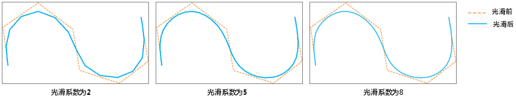

　　When there are too many line segments in polylines or boundaries of regions to go against next process or analysis, sometimes to make the display or print effects not satisfactory, simplifying data is required. There are two ways to simplify data: Resample and Smooth. Smooth is a way that replaces original polylines with curves or straight lines through adding nodes.

### Basic steps

 1. In the toolbox, click "Data Processing" > "Vector" > "Smooth Line and Region" to open the "Smooth Line and Region" dialog box.
 2. Specify the dataset (line, region or network) you want to smooth.
 3. **Smoothness**: The count of vertexes to be interpolated between two adjacent nodes, it is an integer larger than or equal to 2. The location of the inserting node is determined with the B Spline. The more interpolation points, the smoother the polyline is after processing. The recommended value range is [2,10].
 
 4. Click "Run" button to perform the operation. 

  

### Note

  - The length of a polyline after the operation will be shorter, and directions of line segments in the polyline will be changed too, but the relative position of two ends will not be changed.
  - The area of a region will be smaller after the operation.

### Related topics

 [Dissolve](Datafuse.html)

