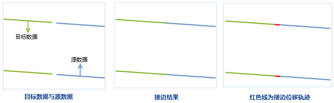

　　This function is used to match and connect line segments from two datasets that are expected to be continuous. 

　　This function is applicable to 2D line datasets. The matching modes include: Other edge, Middle point.

### Basic steps

 1. In the toolbox, click "Data Processing" > "Vector" > "Edge Match" to open the "Edge Match" dialog box.
 2. Specify the source dataset and target dataset. **Note**: The two datasets must have the same coordinate system. The operation will modify the target dataset directly, hence backing up the target dataset is suggested. 
 3. **Mode**: Three types of matching for the source and target dataset are improved as explained below:

  - **Other Edge**: the matching edge lines in the source and target dataset will match and connect to each other at their nodes. 
  - **Middle Point**: the matching edge lines in the source and target dataset will extend and connect to each other at the middle location of their ends. 
 
 4. Tolerance: When the two lines that the distance between their adjacent ends is less than the tolerance, the two lines are considered as connective.
 5. Edge Match Union: check this option to union the two matched edge lines into one. And the other objects from the source dataset will also be appended to the target dataset.
 6. Generate Edge Match Link Data: check this option and the auxiliary lines in the operation will be saved as a line dataset. The auxiliary lines are the traces for the connecting operation. You can set a name for the result dataset and specify a datasourcce to save it.
 7. Click "Run" to perform the operation.

  

### Related topics

 [Dissolve](Datafuse.html)

