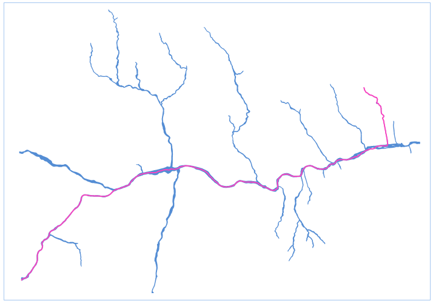

　　Extract the center line of the main street from the region dataset as the longest length of the region object and save results in a line dataset. This function is often used to get the center lines of main rivers.

　　By default, the extraction will follow the longest length of the region object; meanwhile, it is also supported to extract the center line from a selected region objects. If the extent of the result center line is unsatisfactory, you can specify the start and end nodes. If the region object has hole(s) in it, the extraction will following a shortest route around the hole(s).

### Basic steps

 1. In the toolbox, click "Data Processing" > "Vector" > "Main Center Line of Region" to open the "Main Center Line of Region" dialog box.
 2. Set the region dataset in which you want to extract the main line of polygons, and set a name for result dataset.
 3. Click "Run" to perform the operation.

  

### Related topics

 [Dissolve](Datafuse.html)

