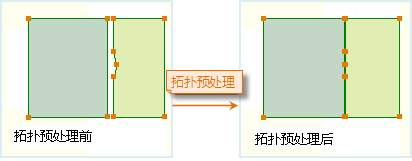
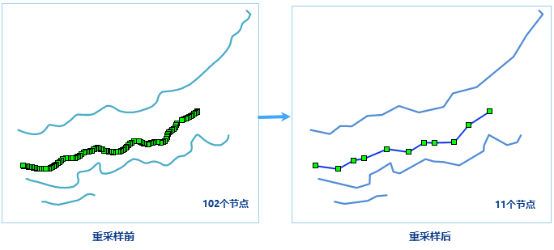

　　When objects have too dense nodes, you can resample the data to remove some nodes as certain rules thereby simplifying your data. Vector Resample are worked for line, region, network dataset and multiple datasets can be processed at a time.

### Basic steps

 1. In the toolbox, click "Data Processing" > "Vector" > "Vector Resample" to open the "Vector Resample" dialog box.
 2. Specify the dataset to be resampled.
 3. **Resample Method**: Two ways are provided: Blend and Douglas-Peucher. To know more about the methods, please refer to Resample. 
 4. **Resample Distance**: It refers to the resampling tolerance, the greater the resampling distance, the simpler the result data. **Note**: The distance must be larger than 0.0000000001 and less than one-tenth of the dataset range.

   

 5.Save Small Geometry: Small Geometries are the region objects whose areas are 0 after resampling, it only works on region objects; When it is checked, the border of the small geometries will be retained. 
 
 6.Topology Preprocessing: You can check this option and set Node Snap Tolerance to perform topology preprocessing on complex region datasets. When the dataset is resampled, the line dataset and the network dataset do not need the operation. The region dataset can choose whether to perform topology preprocessing. Topology preprocessing preserves topological relations of region datasets to ensure that no gaps occur during resampling of common borders. 
  
　　It is mainly used for processing these intersection and adjacent polygons; when there are different numbers of nodes on the two sides of the adjacent or intersection borders, and the distance from the node to the neighbouring border is less than the node snap tolerance, the two sides will be merged by location, the number of nodes will be added until the same. 

   

 
 7.Click "Run" to perform the operation. Following picture is the result for resampling distance is 5 meter.

  

### Note

　　The operation will be done on the source dataset directly which will changed your dataset, so backing up your dataset is better.

### Related topics

 [Dissolve](Datafuse.html)

