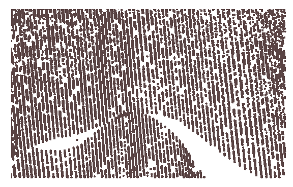

### Instructions

　　The points in the lidar data are very dense, also called point cloud data. It stores the coordinate X, coordinate Y and elevation information. SuperMap iDesktop 9D supports importing lidar data in *.txt format as a 2D/3D dataset.

### Basic steps

　　1. After adding the \*.txt file, double click the item in "File Type" and then select "LIDAR file".
　　2. On the parameter settings of Result Settings and Source File Info in the "Import Data" dialog box, please refer to [Common Parameter](GeneraParameters.html).
　　3. **Ignore Attribute Information**: Check it to import its attribute information when importing Lidar data.
　　
　　
 

### Related topics

 [Buffer analysis](BufferTheory.html)

 [Sample Application on Buffer Analysis](BufferAnalyst_Example.html)

