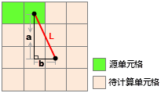
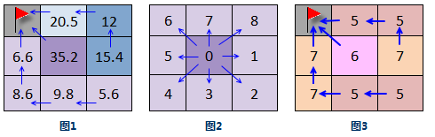
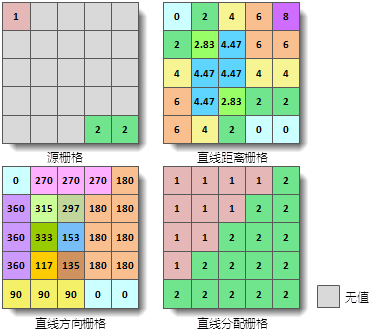
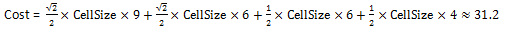
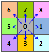
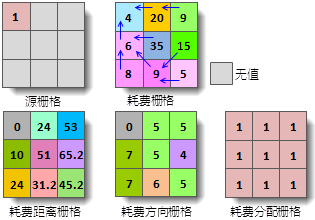
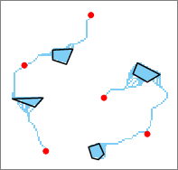
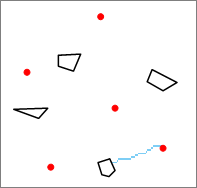

　　Analyze every spatial distance between a grid and its adjacent cell to reflect the spatial relationship between them. Not only the surface distance need to be considered, but also all kinds of costs should be considered too. The Distance Raster involves three aspects:

 - Generate distance raster, direction raster and allocation raster.
 - Analyze the shortest path based on the generated distance raster.
 - Calculate the shortest path between the source point and the target point including the least-cost path and the shortest surface path.

　　A lot of effective information which help people to manage and plan resources can be obtained. Such as: 

 - The closest hospital from the area where there was an earthquake in.
 - The assessment of service area of a supermarket chain.

### Basic conception

 - **Source**: Features you want to reserch like schools, roads or others.
 - **Source dataset**: The dataset containing sources. It could be a point, line, region or raster dataset. For a raster dataset, except the cells representing sources, other cells must be No-Value.
 - **Distance*: Contains straight-line distance, cost distance and surface distance.

   - The straight line distance is Euclidean distance which is the distance from a cell to the closest source.
   - The cost distance is the real cost from a cell to the closest source which is got by weighting one or more attributes of the cell.
   - The surface distance is the real surface distance calculated out from a cell to the closest source. The straight-line can be considered as the least cost which is the simplest cost. On the other hand, in real life, there are various features like rivers, mountains which lead to it is impossible to get to the destination through a straight line.

 - **Cost Raster**: Cost raster is used for determining cost passing every cell. The value of a cell which must be positive represents the cost of passing one unit of this cell. For example, the value of a cell represents the resistance value for travel 1 kilometer in the cell, so the total cost for car to pass the cell is the cost value (cell value) multiplies by the size of the cell. The unit of the cost raster can be of any unit, such as length, time, price, etc., or the cost can have no unit, such as the slope, exposure and land use after reclassify.
   
###  Generate straight-line distance raster

　　Calculate the distance between cell and source. The result can be used to resolve following three questions:

 - Distance from cell to the closest source like to the closest school.
 - Direction from cell to the closest source like to the closest school.
 - Cells to be allocated to the source data according to the spatial distribution, such as the location of the several nearest schools. 

Three kinds of datasets will be got: distance raster, direction raster and allocation raster. As shown below.

   

　　In real life, the straight-line distance raster is often used for the situation that there are not any obstacles in routes. Such as in the sky, through the straight-line distance, the distance from the rescue plane to every hospital can be determined thereby the closest hospital can be got. However, for a rescue car, there all a variety of obstacles in surface, hence the straight-line distance can not resolve the real problem. 

   
**Straight-line distance raster**

　　The value of straight-line distance raster represents the Euclidean distance (straight-line distance) between a cell and its nearest source. The cost of the straight-line distance can be considered as the distance, it is the simplest cost. Straight line distance raster does not consider cost, that is the path has no barrier or has the same cost. The source data to create straight-line distance raster can be vector data (point, line, region) or raster data. The results including straight-line distance raster dataset, straight-line direction raster dataset and allocation raster dataset.

　　For every cell, the straight line distance between its center and source center is the distance from cell to source. The algorithm is as follows (among them, the CellSize is 10): 
　　

 　　 The distance L is:

　　

**Direction raster**

　　Direction raster represents azimuth direction between each raster cell and the closest source. It all contains straight line direction raster and cost direction raster. The value of straight line direction raster represents the azimuth form a cell to its nearest source, the unit is degree. The north is 0 degree, makes clockwise rotation, the range is 0-360 degree. For example, if the nearest source is to the east of the cell, the value of the cell is 90 degree.

　　The value of the cost direction raster represents the direction from a cell to its nearest source with the least cost path. As shown below:

   - **Figure 1**: the least cost path form each cell to the source (represented by small red flag) is identified with arrows.
   - **Figure 2**: the direction values. Such as,  the value of turning west is 5 and turning east is 1.
   - **Figure 3**: the cost direction raster of the raster data in fig1. The value of the source cell in the cost direction raster dataset is 0. The cells in the direction dataset with the value 0 are not all sources, for example, if a cell has no value in the input raster dataset, it's value will also be 0 in the output cost direction dataset.

　　

**Allocation raster**

　　Identifies the closest source of each cell and its raster value is the value of the closest source. If the source is raster, the value is its raster value, but if the source is a vector object, the value is its SMID. Allocation raster can allocate spatial resources to different source objects like the service areas of post offices.
　　Following pictures illustrate how to generate straight-line allocation raster and each cell size is 2.

　　

###  Generate cost distance raster

　　When the straight line distance from B to source A is the same with that from C to source A, if there is a traffic jam on the B-A road but the C-A road is clear, their time-consuming are different. Hence, in real life, through straight-line distance, the real problem can not be resolved.

　　The cost distance is the real cost value to the closest source which is obtained through weighting one or more attributes of a cell like cost time, cost money and so on. The "Generate Cost Distance Raster" function can generate corresponding cost distance raster, cost direction raster and cost allocation raster according to the source dataset and cost raster. 

　　

**Cost distance raster**

　　Expresses the least cost from every cell to the closest source, and its raster value is the cost value from the current cell to its closest source. To the No-Value raster, the calculated values are No-Value too.

　　The algorithm is: from the center of cell, the passed distance to every cell multiplies the cell value then sum these values to get the cost value. In the following figures, the cell size of source raster and cost raster is 2, and the least cost route from the cell(2, 1) to the source (0, 0) is the red one.

　　

　　The least cost is:

　　

**Cost direction raster**

　　Expresses the direction from every cell to its closest source. The probable directions contain: north, south, west, east, north-west, south-west, south-east, north-east which are encoded with integer 1 to 8. Note, the value of source cell is 0, and 15 is assigned to the No-Value cell in the output cost direction raster.

　　

**Cost allocation raster**

　　Identifies the closest source of every cell whose raster value is the value of the closest source. If the source is raster, the value is its raster value, but if the source is a vector object, the value is its SMID. For the No-Value raster, the values in output cost allocation raster are No-Value too.

　　Following pictures illustrate how to generate a cost allocation raster. Every cell size is 2. In the picture Cost Raster, the blue arrows identify the routes from cell to the closest source. The values in Cost Direction Raster are the directions from the current cell to its closest source.

　　

###  Calculate the shortest route

　　According to the target dataset, cost distance raster and cost direction raster, calculates the shortest path from cell to the closest source.  

　　For example, analyze how to get to the nearest shopping mall (point data set) from each residential plot (area dataset). Firstly, the shopping mall is taken as the source, and the consumption raster and consumption direction raster are generated. The shortest path analysis is carried out on the basis of the generated consumption distance raster and the consumption direction raster, and the residential area can be obtained to the nearest shopping mall (source) of the shortest path.

　　The shortest path has three types: cell path, zone path and single path. 

 - **Cell path**: A path is generated for each grid cell connecting that cell and the closest source. As shown in the following figure, the red dot is the source and the black polygon is the target. The blue cell represents the shortest path obtained.

　　

 - **Zone path**: A path is generated for each cell zone. A cell zone consists of contiguous cells with equal values. A path for a target zone is the least-cost path from the zone to the closest source. As shown in the following figure, the red dot is the source and the black polygon is the target. The blue cell represents the shortest path obtained.

　　

 - **Single path**: Only one path is generated for all grid cells. This path is the one with the least cost among all the paths connecting the entire target area dataset. As shown in the following figure, the red dot is the source and the black polygon is the target. The blue cell represents the shortest path obtained.
 
　　

###  The shortest path between two points

　　Calculate the shortest path between the source point and the target point. Calculate the shortest surface path,  the least cost path and the least cost path which considers the surface distance.

###  The shortest cost path

　　It is needed to specify the cost raster when calculating least cost path. Cost raster is used to specify the cost needed for passing each cell. The value of a cell represents the cost of passing one unit of this cell. For example, a cost raster represent the cost for car in different ground environment, the value of a cell represents the resistance value for travel 1 kilometer in the cell, so the total cost for car to pass the cell is the cost value (cell value) multiply by the size of the cell. The unit of the cost raster can be of any unit, such as length, time, price, etc., or the cost can have no unit, such as the slope, exposure and land use after reclassify. Usually, in a research, there may be many factors that influence the cost, for example, in the planning of a new road, the factors that influence the cost may include the total length, the land use of the passed area, slope, the distance to the population concentration area, etc. It is needed to weight the factors to get a comprehensive weight as the cost data. Note that the cost cannot be a negative value.

　　

### Related topics  

　　 [Generate distance raster](CreateRasterDistance.html)
 
　　 [Calculate the shortest path](ShortPath.html) 
   
　　 [The shortest path between two points](TwoPointDis.html) 
   
　　 [The shortest cost path between two points](TwoPointCostDis.html)    
 

