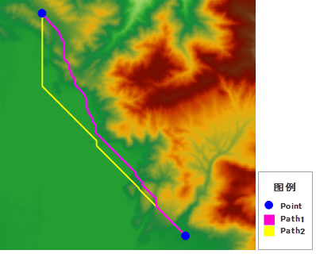
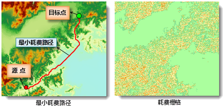

　　There are two situations existed according to the settings of parameters:

 - Specify the DEM raster but the cost raster, that is the source data is DEM raster data, then the result will be the shortest surface path. 

 - Only specify the cost raster but the DEM raster, that is the source data is cost data, so the result will be the least cost path which can be obtained with the Least cost path functionality. 

　　Following picture shows the comparative results of calculating the shortest surface path and the least cost path. The two blue points are the start point and end point, and Path1 is the shortest surface path got by only specifying DEM raster; Path2 is the least cost pat got by only specifying the cost raster.

　　

### Instructions

　　The least cost path between two points is the shortest path along the raster surface. 

### Basic steps

1. Two function entrances are provided:
 - Under the "Spatial Analysis" tab on the "Raster Analysis" group, click "Distance Raster" then select "Least Cost Path".
  - In the toolbox, click "Raster Analysis" > "Distance Raster" > "Least Cost Path" or drag the item into the model panel.

2. **Cost data**: The cost raster for calculating distances. It is used to determine the cost of passing each cell.
3. **Coordinate**: Enter the values of coordinate X and Y of source point and target point respectively. Also you can pick up a point then click the "Input Source Point" or "Input Target Point" to paste the picked coordinate values.
4. **Smoothness Method**: Provided two methods: B-Spline, Polish. 
5. **Smoothness**: The value of smooth degree is related to the smooth method. If you choose B Spline, when the smooth degree is less than 2, it will not work; if you choose Polish, when the smooth degree is greater than or equal 1, it is valid. The larger the smooth degree is, the smoother the line is.
6. **Result Data**: Set a name for the result dataset and specify a datasource to save it.
7. Click "Run" image button to perform the operation. The figure below is an instance of calculating the least cost path between two points. This example uses the reclassify result of the DEM raster slope as the cost raster, and calculates the least cost path between the given source point and the target point.

### Note

　　The raster value in the consumption data must be greater than 0. If the raster value is less than 0, the analysis will fail. 

### Related topics   
 
　　 [Distance raster overview](AboutRasterDistance.html)  

　　 [Generate distance raster](CreateRasterDistance.html)
 
　　 [Calculate the shortest path](ShortPath.html) 
   
　　 [The shortest cost path between two points](TwoPointDis.html) 
    
 

