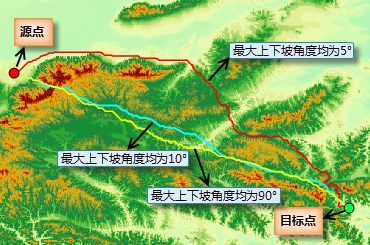

　　There are two situations existed according to the settings of parameters:

 - Specify the DEM raster but the cost raster, that is the source data is DEM raster data, then the result will be the shortest surface path. 

 - Only specify the cost raster but the DEM raster, that is the source data is cost data, so the result will be the least cost path which can be obtained with the Least cost path functionality. 

　　Following picture shows the comparative results of calculating the shortest surface path and the least cost path. The two blue points are the start point and end point, and Path1 is the shortest surface path got by only specifying DEM raster; Path2 is the least cost pat got by only specifying the cost raster.

　　

### Instructions

　　Calculates the shortest surface path between the source and target points (two points), that is the surface distance along the surface between two points.

### Basic steps

1. Two function entrances are provided:
 - Under the "Spatial Analysis" tab on the "Raster Analysis" group, click "Distance Raster" then select "Shortest Surface Path".
  - In the toolbox, click "Raster Analysis" > "Distance Raster" > "Shortest Surface Path" or drag the item into the model panel.

2. **Source Dataset**: The dataset provides elevation information for calculating distance.

3. **Coordinate**: Enter the values of coordinate X and Y of source point and target point respectively. Also you can pick up a point then click the "Input Source Point" or "Input Target Point" to paste the picked coordinate values.
3. **Smoothness Method**: Provided two methods: B-Spline, Polish. 
4. **Smoothness**: The value of smooth degree is related to the smooth method. If you choose B Spline, when the smooth degree is less than 2, it will not work; if you choose Polish, when the smooth degree is greater than or equal 1, it is valid. The larger the smooth degree is, the smoother the line is.
5. **Max Upslope**: The upslope degree is the angle between the upslope direction and the horizontal plane. The direction that the upslope degree is larger than this value will not be selected, and the path will not pass the cell. The default value is 90 degree, that is there is no restriction for the upslope degree. 

6. **Max Downslope**: The downslope degree is the angle between the downslope direction and the horizontal plane. The directions that the downslope degree is larger than this value will not be selected, and the path will not pass the cell. The default value is 90 degree that is there is no restriction for the downslope degree. 
7. **Result Data**: Set a name for the result dataset and specify a datasource to save it.
8. Click "Run" image button to perform the operation. The figure below shows analysis results with different maximum upslope/downslope degrees.

### Note

　　There may be not analysis results if you set maximum upslope/downslope degrees because of no path meets the condition in the terrain data.

### Related topics  

 
　　 [Distance raster overview](AboutRasterDistance.html)  

　　 [Generate distance raster](CreateRasterDistance.html)
 
　　 [Calculate the shortest path](ShortPath.html) 
   
　　 [The shortest cost path between two points](TwoPointCostDis.html)    
 

