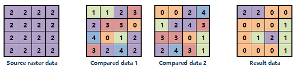

　　With the common statistics function, the comparison between a raster data and one or more raster datasets or a fixed number can be achieved. The comparison methods include: 
  
-  **Compared with a fixed value**: Compares each cell of a raster dataset with a fixed value as a special method, and the pixel value that the comparison result is true is set as 1, others' pixel values are set as 0. As follows, the fixed value is 1, and the comparison method is ">", then the pixel value which is bigger than 1 results in 1.
  

　    
  
-  **Compared with other raster dataset**: Compare the input raster dataset with the corresponding cells in one or more raster datasets. The result cell values are the times of "true" in the comparison. If a raster dataset A is compared with B and C raster datasets, the result will be the sum times of the comparison results are true (A-B and A-C). As follows, the Compare Type is >, the result data is obtained through the result 1 comparing the source data with data 1 pluses result 2 comparing the source data with data 2. 

　    
 
  
### Basic steps

1. Two function entrances are provided:
 - Under the "Spatial Analysis" tab on the "Raster Analysis" group, click "Raster Statistics" then select "Common Statistics".
  - In the toolbox, click "Raster Analysis" > "Raster Statistics" > "Common Statistics" or drag the item into the model panel.
2. Specify the raster data for statistics. 
3. Specify the comparison method. According to the method you choose, set following parameters:
   
  - **Compare Type**: Specify the comparison method including: >, <, >=, <=, ==.
  - **Fixed Value**: If you select this radio button, you need to enter a number for comparing.
  - **Raster Dataset**: If you select this radio button, you need click "Add" image button to add one or more raster datasets.  
 
4. Ignore NoValue: Checking it means the NoValue cells will not be involved in the operation. **Note**: When a raster dataset is compared with other raster datasets, whether to ignore NoValue will have an affect to the statistics result, and the amount of compared raster datasets will have an affect to pixel formats of NoValue's value.
  
  - **Whether to ignore NoValue cells**: If you do not check the "Ignore NoValue" checkbox, when there are NoValue cells in the source raster dataset, they will participate in the comparison too. 
  - **Values of NoValue cell in result**: When the NoValue cells do not participate in the operation, the values of NoValue depend on the pixel format of result dataset. Such as, the cell format is UBit8 (8 bits indicate a cell), then the value of NoValue cells is 255. The cell format depends on the number of compared raster datasets. The table below details the relationship.
    
Number of compared datasets (n)|Result cell format|Values of No-Value cells  
-|-|-  
0＜n＜15|UBit4|15  
0＜n＜15|UBit8|255 
0＜n＜15|Bit32|-9999
   
5.Enter a name for the result dataset and specify a datasource to save the result.
6.Click "Run" image button to execute the operation.  

### Related topics

 [Basic statistics](BasicStatistic.html)  
 [Neighbor statistics](NeighbourStatistic.html)    
 [Zonal statistics](ZonalStatistic.html)  
 [Elevation statistics](AltitudeStatistic.html)    

