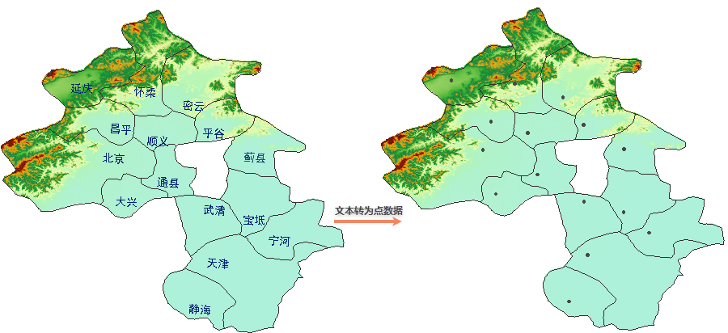
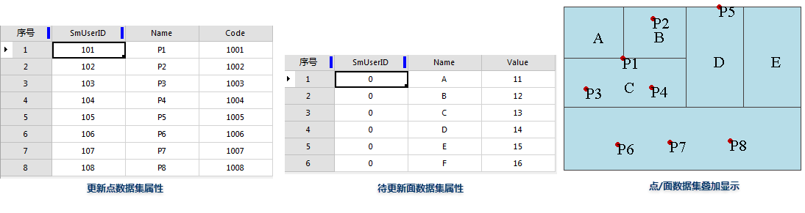
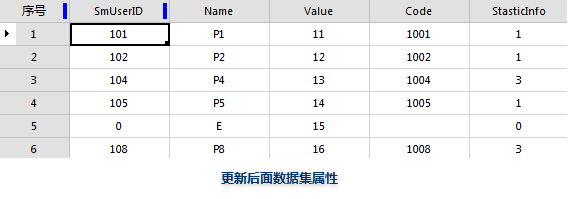

  
### 字段转为文本数据　  

 - 把数据集中的某个字段内容，转变到文本数据集，通过此功能可以实现地图标注。例如我们可以将 China 数据源下 Province\_R 数据集的 Name 字段转换为文本数据，将此文本数据和 Province\_R 数据集在同一窗口中显示，以实现对 Province\_R 数据集的标注。  
 -  字段到文本后的文本位置由其所对应对象的**内点**所确定的。如果转换后文本的位置不理想，可以通过改变文本对象对齐方式的方法进行调整。对于不同的几何对象，内点位置不同：    
  
	- 点对象的内点是该点本身；  
	- 简单线对象内点：当节点个数为奇数时，取中间一个节点为内点；当该节点个数为偶数时（多于两个节点的情况），取中间两个节点之后者；当该子对象有两个节点时，取两节点之中心为内点；
	- 复杂线对象内点：是线对象的节点数最多的子对象的内点，当线对象只有一个子对象时，取该子对象的内点，若多个子对象的节点数一样最多，则根据子对象索引值，取索引值最小的子对象的内点；  
	- 面对象的内点是在几何对象的内部，并靠近中央的点；  
	- 文本对象的内点是该文本对象的第一个子对象的锚点。  
	
- 适用于点、线、面、文本、三维点、三维线、三维面、二维网络数据、三维网络数据集以及模型数据集。 
 
   
   
**操作说明** 
  
　　1. 在“字段—>文本数据”对话框中，分别在“源数据”和“结果数据”处设置待转换的数据集和转换后结果数据集。  
　　2. 设置“**转出字段**”， 即为需要转为文本数据集的字段。单击执行按钮，进行属性转为点数据的操作。 
　   

  
### 文本数据转为字段 
　　  
  将文本数据集中的文本信息添加到它的属性表中，需要指定转换后文本信息保存的字段。
   
**操作说明** 
  
　　1. 在“文本数据—>字段”对话框中，在“源数据”处设置待转换的文本数据集。    
　　2. 在参数设置的“**转出字段**”处，选择保存文本信息的字段。  
　　  
**注意事项**   
  
- 该字段为非系统字段且必须是非数值型属性类型。  
- 字段的长度必须设置为等于大于文本对象中最长文本的长度（包括计算空格），否则文本长度大于字段长度的文本对象将不能转换到字段中。  
- 若选择的已有字段已有属性信息，进行转换操作后会覆盖原字段的内容。

  
### 文本数据转为点数据  
　　  
  将文本对象的锚点提取出来生成新的点数据集。锚点跟文本的对齐方式有关。文本的锚点，即文本的对齐基点，可以是文本的左上角、左下角等。文本的锚点位置可以在 “风格设置”选项卡“文本风格”组中，通过对齐方式设置。  
  
 
   
   
  
**操作说明**
  
在“文本数据—>点数据”对话框中，分别在“源数据”和“结果数据”处设置待转换的文本数据集和转换后结果数据集，单击执行按钮，进行文本数据转为点数据的操作。
 
  
### 属性转为点数据    
  
将属性表中的字段值指定为 X、Y 坐标值并据此创建相对应的点对象，从而生成一个或多个点数据集。
  
**操作说明** 
  
　　1. 在“属性—>点数据”对话框中，在“源数据”处设置待转换的数据集。    
　　2. 在参数设置的“**转出字段**”处，分别指定X坐标、Y坐标对应的属性字段。单击执行按钮，进行属性转为点数据的操作。  
　　  
**注意事项**   
  
- XY 的字段格式支持经纬度坐标，但由于 XY 字段类型都是双精度的，因此只支持度格式。而且生成的数据集所在数据源必须为经纬度坐标系；
- 源数据集可以为点、线、面、文本、网络数据集，TIN 数据集，三维点、三维线数据集。
  

### 点属性转为面属性    
  
将点数据属性中的非系统字段值更新到对应面数据的属性中。该功能是将面对象中的点属性更新到面属性中，若一个面内包含了多个点，则会从其中随机选择一个点，将其属性更新到所在的面对象中，同时会增加一个“StasticInfo”统计字段，用于统计每个面对象中包含的点个数。
 
**操作说明**
  
 在“点属性—>面属性”对话框中，分别在“源数据”和“结果数据”处设置更新点数据集和待更新的面数据集，单击执行按钮，进行点属性转为面属性的操作。具体属性更新见下表图示及说明：  

   

从点数据集、面数据集的属性表可看出：  
  
- 点数据集和面数据集有 SmUserID、Name 两个相同字段；  
- 点数据集有一个单独字段 Code，面数据集有一个单独字段 Value；   
- 点数据集和面数据集的相同字段值不相同。  
  
更新后得到如下结果：  
 
   

- 增加了一个来源于点数据集的字段 Code 和一个系统生成的记录字段 StaticInfo；  
- 面数据集的原有单独字段 Value 值没有变化；   
- StaticInfo 字段值与面中更新点的数目相同；  
- 面A、B、C、D、F属性被点 P1、P2、P4、P5、P8 更新，SmUserID 和 Name 值均更新为对应点对象的属性值。 

