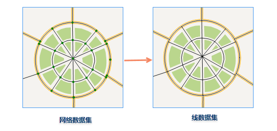
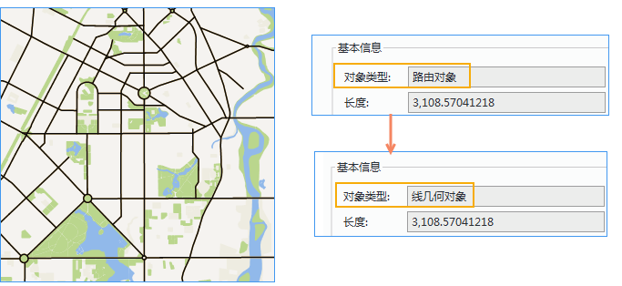

　　网络数据集转换功能包括：网络数据转点数据、网络数据转线数据、路由数据转线数据。

### 网络数据转换为线数据  

- 将网络数据集中所有网络弧段提取出来生成新的线数据集。  
- 新生成的线数据集的属性表中，系统字段（除 SmUserID 以外）由系统赋值，而字段 SmUserID 和其他非系统字段属性沿用源网络数据集属性表的相应字段值。 
 
**操作说明**  
  
　　在工具箱的“类型转换”选项中选择“网络数据->线数据”，在弹出对话框中，分别设置待转的网络数据集和结果线数据集，单击"执行按钮"，进行网络数据转为线数据的操作，结果如下图所示。  

   

### 网络数据转为点数据  
  

 - 将网络数据集中所有网络结点提取出来生成新的点数据集。  
 - 新生成的点数据集的属性表中，系统字段（除 SmUserID 以外）由系统赋值，而字段 SmUserID 和非系统字段沿用源网络数据集中子点数据集属性表的相应字段值。 

 
**操作说明**
  
　　在工具箱的“类型转换”选项中选择“网络数据->点数据”，在弹出对话框中，分别设置网络数据集和结果点数据集，单击执行按钮，进行网络数据转为点数据的操作，结果如下图所示。  

   

### 路由数据转点数据

 - 将路由数据集中所有路由对象转化为新的线数据集。   
 - 新生成的线数据集的属性表中，系统字段（除 SmUserID 以外）由系统赋值，而字段 SmUserID 和其他非系统字段属性沿用源路由数据集属性表的相应字段值。 

**操作说明**
  
　　在工具箱的“类型转换”选项中选择“路由数据->点数据”，在弹出对话框中，分别设置路由数据集和结果线数据集，单击执行按钮，进行路由数据转为线数据的操作，结果如下图所示。  

   