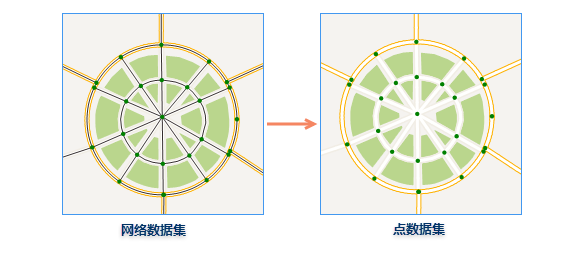

  
### 使用说明    
  

将网络数据集中所有网络结点提取出来生成新的点数据集。  
新生成的点数据集的属性表中，系统字段（除 SmUserID 以外）由系统赋值，而字段 SmUserID 和非系统字段沿用源网络数据集中子点数据集属性表的相应字段值。 

 
### 操作说明  
  
 在“网络数据—>点数据”对话框中，分别在“源数据”和“结果数据”处设置网络数据集和结果点数据集，单击执行按钮，进行网络数据转为点数据的操作，结果如下图所示。  

   

