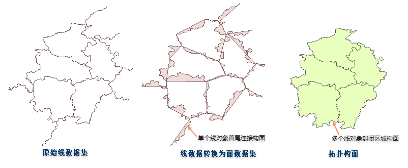
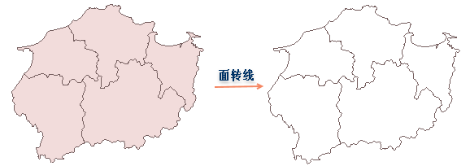

### 线数据转为面数据   
  
SuperMap iDesktop Cross 支持将线数据转为面数据，即通过将线数据集中每个线对象的起点与终点相连接而构成一个面对象，起点与终点的连接方式是最短距离的直线连接构成一个面对象。当线对象为单一直线且构面的面积为0时，则该对象构面失败。常用于当用户需要以单个线对象作为处理线转面的操作时。若用户想要将多个线对象构成的封闭区域进行构面时，可使用“拓扑构面”功能，请参看“拓扑构面”文档。  
  

  
  
- 如果输入的线图层包含复合对象，输出的面数据仍为复合对象，可以通过使用分解功能，将转换后的面对象分解为简单对象。 
- 新生成的面数据集（或追加后的数据集）继承源数据集的字段 SmUserID 和所有非系统字段的属性信息。

  
  　　  
### 面数据转为线数据  
  
SuperMap iDesktop Cross 支持将面数据转为线数据，即通过将面对象的边界转化为线，从而创建一个包含线对象的数据集。    
  
- 输入的面数据的属性信息能够全部保留。新生成线数据会继承源数据集的字段 SmUserID 和所有非系统字段的属性信息。   
- 多个面数据转为线数据时，生成的线数据的投影与源数据（转换前的面数据集）的投影保持一致。 
- 输入的图层包含复合对象，输出的线仍为复合对象，可以通过使用分解功能，将转化后的线对象分解为简单对象。 
   
  

  

