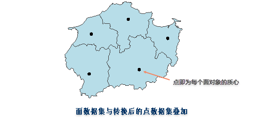

  
### 使用说明
　　SuperMap iDesktop Cross 支持持将面数据转为点数据，即通过将面数据集中的每个对象的质心提取出来生成一个新的点数据集。新生成的点数据集会继承源数据集的 SmUserID 和所有非系统字段的属性信息。 常用于当用户想要用点数据表示对象位置信息时，可将已有的面数据转为点数据，同时保留了面对象的属性值又能精确的表示面内的位置信息。 
  

  
  
   
  
### 操作说明  
  
　　在“面数据—>点数据”对话框中，分别在“源数据”和“结果数据”处设置待转换的面数据集和转换后结果数据集，单击执行按钮，进行面数据转为点数据的操作。  

  

