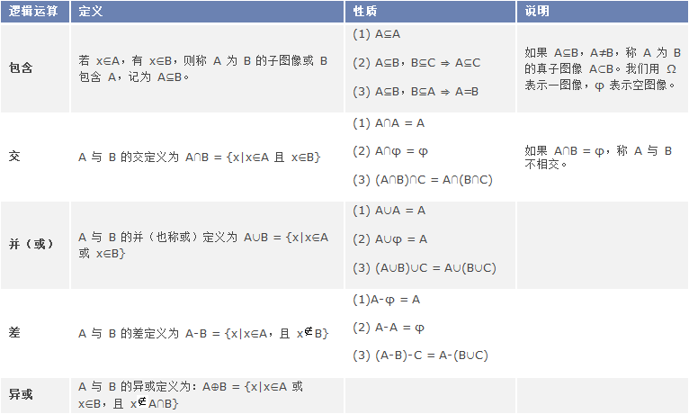
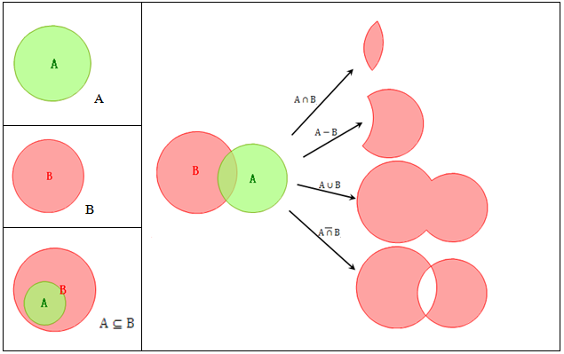

title: 叠加分析原理
---

　　叠加分析是通过对空间数据的加工或分析，提取用户需要的新的空间几何信息。比如，我们需要了解某一个行政区内的土壤分布情况，就可以根据全国的土地利用图和行政区规划图这两个数据集进行叠加分析，得到我们需要的结果。同时，通过叠加分析，还可以对数据的各种属性信息进行处理。  
  
　　叠加分析广泛应用于资源管理、城市建设评估、国土管理、农林牧业、统计等领域。   
 
　　空间叠加分析涉及到逻辑交、逻辑并、逻辑差、异或的运算，为了讨论方便，此处将欧氏空间图层A，B，C定义为二值图像，下表介绍了图层布尔逻辑运算的性质与定律。为了讨论方便我们将欧氏空间图层 A，B，C 定义为二值图像。  
  
   

下图为布尔逻辑运算的包含，交，并，差，异或。

   

### 使用说明  

参与叠加分析的面数据集中，不能有交叠的面对象。有交叠面对象的数据集为非法数据集，系统将不能保证叠加结果的正确性。建议做叠加分析之前先进行拓扑检查。

### 注意事项  
   
1. 进行叠加分析的两个数据集中，用于叠加分析的数据集的类型可以是点、线、面等，被称作输入数据集（在 SuperMap GIS 中称作第一数据集）；另一个数据集是面数据集被称作叠加数据集（在 SuperMap GIS 中称作第二数据集）。  
2. 应注意面数据集或记录集中本身应避免包含重叠区域，否则叠加分析结果可能出错。   
3. 叠加分析的数据必须为具有相同地理参考的数据，包括输入数据和结果数据。   
4. 在叠加分析的数据量较大的情况下，需对结果数据集创建空间索引，以提高数据的显示速度。 

  

###  相关主题

[生成单重缓冲区](SingleBuffer.html)

[缓冲区分析应用实例](BufferAnalyst_Example.html)

