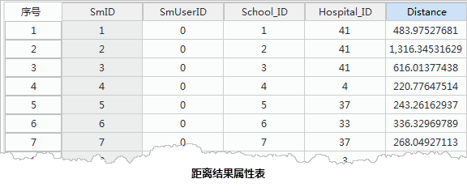
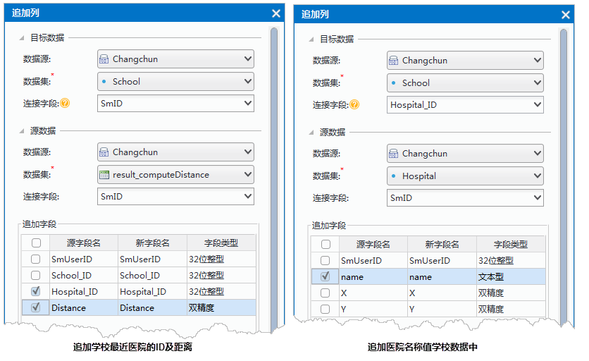
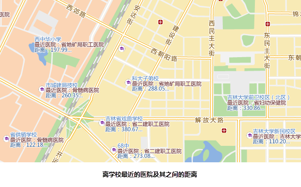

title: 距离计算
---
   
### 使用说明
 
距离计算可用于计算点到点、线、或面的距离，可计算指定查询范围内点、线或面到被计算点的距离，计算结果保存在一个新的属性表中，字段包括：源数据点的ID，临近要素ID（点、线或面要素），以及它们之间的距离值。

### 应用场景  
  
距离计算功能可查看两组事物间的邻近性关系。例如，若您需要比较多种类型的企业点（如影剧院、快餐店、工程公司或五金商店）与社区问题（乱丢废弃物、打碎窗玻璃、乱涂乱画）所在位置之间的距离，可将搜索限制为一公里来查找关系。然后计算出企业和社区问题的距离将保存到属性表中，该结果用于安排公用垃圾桶或巡警。

使用距离计算还可查找：与受污染井距离在指定范围内的所有水井和距离。

### 操作说明

1. 在工具箱的“矢量分析”-“邻近分析”选项中，双击“距离计算”，即可弹出“距离计算”对话框。   
2. 设置源数据：选择距离计算的数据集所在的数据源及点数据集或网络数据集。若选择网络数据集，则参与计算的数据为其中的节点数据。   
3. 设置邻近数据：选择参与距离计算的邻近数据所在的数据源及数据集。可选择点、线、面或网络数据集，在距离计算时作为终点。  
4. 计算方式：选择距离计算的计算方式，包括最近距离、范围内距离两种。  
  
	- **最近距离**：即从源数据集中的点对象出发，根据设置的查询范围，计算查询范围内邻近对象与源对象之间的距离，并记录距离最近的一个或多个对象ID和距离值。  
	- 若选择的计算方式为“最近距离”，可在“查询范围设置”处勾选最小距离或最大距离复选框，设置距离计算的最小或最大距离值，单位与数据集单位一致。设置最大、最小距离后，只有与源数据集点对象距离大于最小距离、小于最大距离（包括等于）的邻近对象参与计算。
 	- **范围内距离**：即从源数据集中的每一个点对象出发，计算每个邻近对象与源对象之间的距离，并根据设置的查询范围，返回距离在最大最小范围内的所有对象ID和距离值。选择“范围内距离”计算方式后，需设置最小、最大距离值，单位与数据集单位一致。 
 
 　　   
5. 设置结果数据集保存名称和保存在的数据源。单击“执行”按钮，即可执行距离计算操作。
 

### 距离计算应用实例  
  
**主题**：计算长春市与学校最近的医院及距离   
**数据准备** ：长春市学校和医院点数据，设置学校点数据集为源数据，医院点数据集为邻近数据；计算方式为“最近距离”；  
**计算结果**：  
  
1.  得到结果为属性表数据，记录了学校ID、与其最近的医院ID及距离信息。

　　    
2. 通过“追加列”功能，将结果属性表中的 Hospital_ID 和 Distance 字段信息追加到学校的点数据集中。再根据医院的ID号，将相应的医院名称追加到学校的点数据集中，具体参数设置如下：  
  
       
4. 完成以上的追加列操作之后，学校点数据中有医院的ID、名称和它们之间的距离信息，对 School 数据集制作矩阵标签专题图，可直观体现学校最近的医院名称和距离等信息，结果如下所示：  
   
　　      

