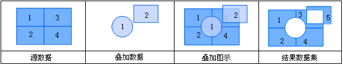
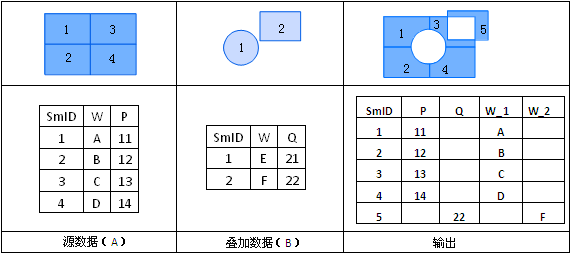

title: 对称差
---

### 使用说明  

对称差运算是两个数据集的异或运算，即对源数据集及叠加数据集进行交集取反操作的功能。操作的结果是，对于每一个面对象，去掉其与另一个数据集中的几何对象相交的部分，而保留剩下的部分。 

  
  
对称差运算的输出结果的属性表包含两个输入数据集的非系统属性字段，如下图所示：

          

### 操作说明   
  
1. 在工具箱的“矢量分析”-“叠加分析”选项中，双击“对称差”，即可弹出“对称差”对话框。  
2. 设置源数据。选择进行“对称差”的源数据集及其所在的数据源。    
3. 设置叠加数据。选择与源数据集进行“对称差”的数据集及其所在的数据源。     
4. 设置结果。选择存储结果数据集的数据源，指定结果数据集的名称。  
5. 设置结果数据集的字段。单击“字段设置”按钮，从源数据集及叠加数据集中选择字段作为结果数据集的字段信息。单击“确定”按钮，表示将选择的字段信息保存的结果数据集中。   
5. **容限值**：根据参与分析的数据集，会自动给出默认的容限值。叠加操作后，若两个节点之间的距离小于此值，则将这两个节点合并，该值的默认值为被裁剪数据集的节点容限默认值，该值可在数据集属性对话框的“矢量数据集”选项卡的数据集容限下的节点容限中设置。  
　　若未在数据集属性中设置节点容限，则此处容限默认值与数据集的坐标系有关，投影坐标系的默认容限为 1m；地理坐标系的默认容限为 0.00001°；平面坐标系的默认容限值为 1，单位与坐标系单位一致。
6. 设置是否进行结果对比：勾选“进行结果对比”复选框，可将源数据集、叠加数据集及结果数据集同时显示在一个新的地图窗口中，便于用户进行结果的比较。
7. 单击“执行”按钮，即可进行对称差操作。