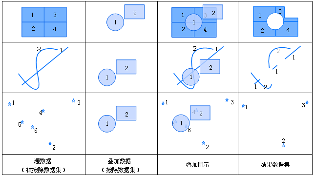
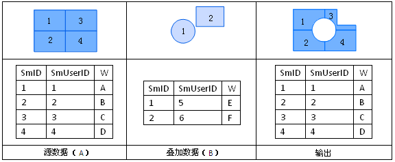

title: 擦除
---

### 使用说明  

擦除是用来擦除掉被擦除数据集中多边形相重合部分的操作。擦除数据集的类型必须为面数据集，被擦除数据集的类型可以是点、线、面数据集。擦除数据集中的多边形集合定义了擦除区域，被擦除数据集中凡是落在这些多边形区域内的特征都将被去除，而落在多边形区域外的特征要素都将被输出到结果数据集中。擦除运算与裁剪运算原理相同，只是对源数据集中保留的内容不同。
 
  
  
擦除运算的输出结果的属性表来自于被擦除数据集的属性表，其类型与被擦除数据集类型相同，如下图所示，自动添加数据集A属性表中的所有非系统字段。

   

### 操作说明   
  
1. 在工具箱的“矢量分析”-“叠加分析”选项中，双击“擦除”，即可弹出“擦除”对话框。  
2. 设置源数据。选择被擦除数据集所在的数据源及被擦除的数据集。   
3. 设置叠加数据。选择擦除数据集所在的数据源及擦除数据集。     
4. 设置结果。选择存储结果数据集的数据源，指定结果数据集的名称。  
5. **容限值**：根据参与分析的数据集，会自动给出默认的容限值。叠加操作后，若两个节点之间的距离小于此值，则将这两个节点合并，该值的默认值为被裁剪数据集的节点容限默认值，该值可在数据集属性对话框的“矢量数据集”选项卡的数据集容限下的节点容限中设置。若未在数据集属性中设置节点容限，则此处容限默认值与数据集的坐标系有关。
6. 设置是否进行结果对比：勾选“进行结果对比”复选框，可将源数据集、叠加数据集及结果数据集同时显示在一个新的地图窗口中，便于用户进行结果的比较。
7. 单击“执行”按钮即可进行擦除操作。