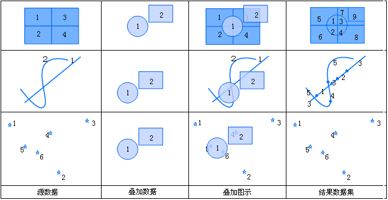
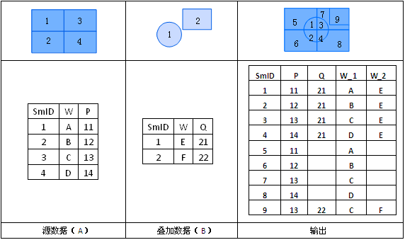

title: 同一
---

### 使用说明  

同一运算结果图层范围与源数据集图层的范围相同，但是包含来自叠加数据集图层的几何形状和属性数据。同一运算就是源数据集与叠加数据集先求交，然后求交结果再与源数据集求并的一个运算。如果第一个数据集为点数集，则新生成的数据集中保留第一个数据集的所有对象；如果第一个数据集为线数据集，则新生成的数据集中保留第一个数据集的所有对象，但是把与第二个数据集相交的对象在相交的地方打断；如果第一个数据集为面数据集，则结果数据集保留以源数据集为控制边界之内的所有多边形，并且把与第二个数据集相交的对象在相交的地方分割成多个对象。
 
  
  
同一运算的输出结果的属性表字段除系统字段外都来自于两个输入数据集的属性字段，用户可以根据自己的需要，从源数据集和叠加数据集的属性字段中选择字段。如下图所示：

     

### 操作说明   
  
1. 在工具箱的“矢量分析”-“叠加分析”选项中，双击“同一”，即可弹出“合并”对话框。  
2. 设置源数据。选择进行“同一”的源数据集及其所在的数据源。    
3. 设置叠加数据。选择与源数据集进行“同一”的数据集及其所在的数据源。     
4. 设置结果。选择存储结果数据集的数据源，指定结果数据集的名称。  
5. 设置结果数据集的字段。单击“字段设置”按钮，从源数据集及叠加数据集中选择字段作为结果数据集的字段信息。单击“确定”按钮，表示将选择的字段信息保存的结果数据集中。   
5. **容限值**：根据参与分析的数据集，会自动给出默认的容限值。叠加操作后，若两个节点之间的距离小于此值，则将这两个节点合并，该值的默认值为被裁剪数据集的节点容限默认值，该值可在数据集属性对话框的“矢量数据集”选项卡的数据集容限下的节点容限中设置。若未在数据集属性中设置节点容限，则此处容限默认值与数据集的坐标系有关。
6. 设置是否进行结果对比：勾选“进行结果对比”复选框，可将源数据集、叠加数据集及结果数据集同时显示在一个新的地图窗口中，便于用户进行结果的比较。
7. 单击“执行”按钮，即可进行同一操作。