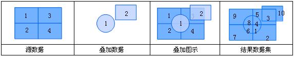
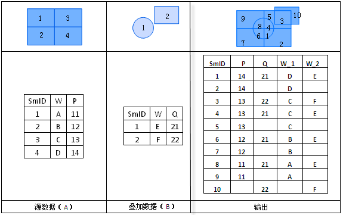

title: 合并
---

### 使用说明  

图层合并是指对源数据集及叠加数据集进行并集操作的功能。进行合并操作的源数据集及叠加数据集的类型必须为面数据集。
进行合并运算后，两个面数据集在相交处多边形被分割，重建拓扑关系，且两个数据集的几何和属性信息都被输出到结果数据集中。
  
  
  
合并运算的输出结果的属性表来自于两个输入数据集属性表，在进行合并运算的时候，用户可以根据自己的需要在A、B的属性表中选择需要保留的属性字段。  
目前叠加分析结果字段名称按照“字段名称_1”和“字段名_2”，如下图所示。
  
 

### 操作说明   
  
1. 在工具箱的“矢量分析”-“叠加分析”选项中，双击“合并”，即可弹出“合并”对话框。  
2. 设置源数据。选择进行“合并”的源数据集及其所在的数据源。   
3. 设置叠加数据。选择与源数据集进行“合并”的数据集及其所在的数据源。    
4. 设置结果。选择存储结果数据集的数据源，指定结果数据集的名称。  
5. 设置结果数据集的字段。单击“字段设置”按钮，从源数据集及叠加数据集中选择字段作为结果数据集的字段信息。单击“确定”按钮，表示将选择的字段信息保存的结果数据集中。  
6. **容限值**：根据参与分析的数据集，会自动给出默认的容限值。叠加操作后，若两个节点之间的距离小于此值，则将这两个节点合并，该值的默认值为被裁剪数据集的节点容限默认值，该值可在数据集属性对话框的“矢量数据集”选项卡的数据集容限下的节点容限中设置。若未在数据集属性中设置节点容限，则此处容限默认值与数据集的坐标系有关。
7. 设置是否进行结果对比：勾选“进行结果对比”复选框，可将源数据集、叠加数据集及结果数据集同时显示在一个新的地图窗口中，便于用户进行结果的比较。
8. 单击“执行”按钮即可进行合并操作。