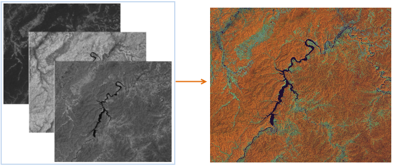

  
### 使用说明  

　　影像合成是将三个单波段的影像数据合成为一幅 RGB 影像，用户可根据需求选择最佳波段进行合成，以提高影像的显示速度和精度。依照加色法彩色合成原理，根据指定的三个波段遥感影像，分别赋予红、绿、蓝三原色，合成彩色影像。

　　不同的波段进行合成，得到的结果影像突出显示的地物特征不同，以 TM 影像的7个波段数据为例，列举常用的波段组合：    

 -  **321 波段**：即真彩色合成，3、2、1波段分别赋予红、绿、蓝色，获得自然彩色合成图像，图像的色彩与源地区或景物的实际色彩一致。适宜于浅海探测作图，同时，适用于非遥感应用专业人员使用。   
 -  **432 波段**：即标准假彩色合成，4、3、2波段分别赋予红、绿、蓝色，标准假彩色图像中的植被显示为红色，可突出体现植被特征，常应用于提取植被信息。在植被、农作物、土地利用和湿地分析方面，是最常用的波段组合。   
 -  **453 波段**：信息量最丰富的组合，在TM数据的7个波段光谱图像中，一般第5个波段包含的地物信息最丰富.采用4、5、3波段分别赋予红、绿、蓝色合成的图像，色彩反差明显，层次丰富，且图上各类地物的色彩显示规律与常规合成片相似，常用于目视解译，同时也应用于确定陆地和水体的边界。  
 -  **741 波段**：该波段组合图像具有兼容中红外、近红外、及可见光波段信息的优势，图像色彩丰富，层次感好，具有极为丰富的地质信息和地表环境信息，且干扰信息少，地质可解译程度高，各种构造形迹（褶皱及断裂）显示清楚，不同类型的岩石区边界清晰。 

### 操作说明

1. 在工具箱的“数据处理”-“栅格”选项中，双击“影像合成”，即可弹出“影像合成”对话框。  
2. 在“影像合成”对话框中对合成波段进行设置：  
  
  - 红波段：设置一个波段的数据集，通过红色通道加载该数据，并以红色为基色对该波段栅格数据进行渲染。  
  - 绿波段：设置一个波段的数据集，通过绿色通道加载该数据，并以绿色为基色对该波段栅格数据进行渲染。  
  - 蓝波段：设置一个波段的数据集，通过蓝色通道加载该数据，并以蓝色为基色对该波段栅格数据进行渲染。   
        
3. 设置结果数据集名称和所保存的数据源，单击“执行”按钮即可进行数据影像合成。下图为432 波段合成的标准假彩色影像。
 
　　　　  

