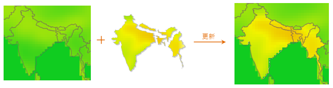

  
### 使用说明  

　　使用一个或多个栅格数据集的内容去更新另一个栅格数据集的相应部分的内容。下图展示了批量数据更新的示例：左图为被更新数据，即目标数据，中间是多个栅格数据集的组图，用来更新目标数据相应位置的内容，右图为数据更新后的结果。  
 　　    
   
栅格数据集更新所用到的数据需满足以下要求：  
  
- 目标数据集和更新数据集的像素格式需一致；   
- 两个栅格数据集的范围有重叠部分，只有重叠部分才能使用更新数据集中的值替换相应部分目标数据集中的值。 

### 操作说明

1. 在工具箱的“数据处理”-“栅格”选项中，双击“数据更新”，即可弹出“数据更新”对话框。  
2. 在“目标数据”框内选择将要被更新的目标数据集所在的数据源及数据集。  
3. 在“源数据”框内包含列表框和工具条按钮两部分。列表框内显示用于更新目标数据集的一个或多个栅格影像数据集，它们将作为更新数据加载到目标数据集中。    
4. 单击“执行”按钮即可进行数据更新操作。

**注意事项**  
  
在对影像数据进行更新时，如果使用的源数据的编码方式为 DCT，则更新的结果会出现的毛边现象。这是由于 DCT 编码方式是一种有损压缩方式，要数据编码后会修改影像边界值。有关数据集编码方式的介绍，请参见数据集压缩编码方式。建议用户在使用数据更新功能时，尽量不要使用 DCT 编码方式的影像，避免出现毛边现象。

