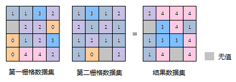
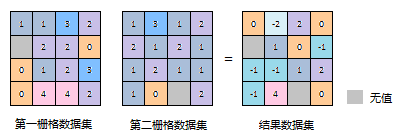
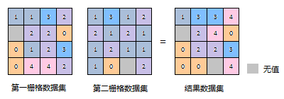

  
### 使用说明  

　　栅格代数运算是运用代数学的观点对地理特征和现象进行空间分析，即对一个或多个栅格数据进行数学运算和函数运算。同时，运算得出的结果栅格数据的像元值是由一个或多个输入栅格数据的同一位置的像元值通过代数运算得到的。    

　　栅格代数运算用途十分广泛，能够帮助我们解决各种类型的实际问题。如建筑工程中的计算填挖方量，将工程实施前的DEM栅格与实施后的DEM栅格相减，就能够从结果栅格中得到施工前后的高程差，将结果栅格的像元值与像元所代表的实际面积相乘，就可以得知工程的填方量与挖方量；又如，想要提取2000年全国范围内平均降雨量介于20毫米和50毫米的地区，可以通过“20<年平均降雨量<50”关系运算表达式，对年平均降雨量栅格数据进行运算而获得。  

　　为了更好的实现栅格代数运算功能，SuperMap 提供了丰富的运算符、函数和运算表达式，除了常用的算术运算（如加、减、乘、除和取整等）方法，还支持通过用户自定义的表达式，来进行栅格的算术运算、条件运算、逻辑运算、函数运算（包括常用函数、三角函数等）和复合运算，用户可以通过栅格代数运算实现多种栅格分析需求。

### 操作说明

1. 在工具箱的“数据处理”-“栅格”选项中，双击“代数运算”，即可弹出“代数运算”对话框，在对话框中分别对栅格代数运算参数和分析环境进行设置。  
2. **代数运算表达式**：在表达式对话框，用户输入的代数运算表达式将显示在其中。单击“设置运算表达式”按钮，弹出“栅格代数运算表达式”对话框。  
  
	- 在左侧列表框内，以目录树的形式列出了当前工作空间下所有的数据源和数据集（这里只支持栅格数据集），双击需要进行栅格代数运算的数据集后，该数据集会以[数据源名. 数据集名]（如[Jingjin. BeijingTerrain]）的格式显示到表达式对话框中。  
	- 在对话框右侧由常用函数、常用运算符和表达式框组成。组成代数运算表达式的不同类型的表达式（包括数据集、数字、常量、运算符、函数等）将以不同的字体风格显示在表达式对话框中，便于用户区分。此外，在表达式对话框内，可以通过单击鼠标右键，在弹出的右键菜单中选择相关编辑选项（包括“剪切”、“复制”、“粘贴”和“清除表达式”等）对已有表达式进行编辑，也可以使用 Windows 快捷键（如 Ctrl+X、Ctrl+C、Ctrl+V、Delete 等）实现编辑操作。在编辑代数运算表达式时，建议用户将一个表达式作为一个整体进行编辑，这样可以保留它们独有的字体风格。   
	 
	**注意**：代数运算表达式的组成应遵循如下规则：  
	- 引用数据集作为运算操作数时，其格式为[数据源名. 数据集名]，例如在数据源 Jingjin 中的 BeijingTerrain 数据集的引用为：[Jingjin. BeijingTerrain]。  
	- 算术运算符的操作数可以是一个数据集、数字或者常量（如对一个数值的函数运算的结果）。   
	- 数学函数的自变量可以是一个数值，也可以为某个数据集，或者是一个数据集或多个数据集的运算表达式。  
	- 当负数作为操作数时，要加上小括号（）。   
	- 表达式中必须至少含有一个输入栅格数据集。  
	    
3. **常用函数**：除了常用的运算符以外，SuperMap 还提供了21种常用的函数，包括算术运算函数、三角函数、指数/对数函数和其它函数四种，下面将详细介绍各类函数的内容。
	- **算数函数**  
函数|说明  
-|-  
abs(x)|绝对值函数  
mod(x, y)|取模函数，即求出 x/y 的余数，其输出值为整数值。当 y>x 时，mod(x, y) = x。  
floor(x)|向下舍入函数，即获得距 x 最近的较小整数（如1.8下舍入为1.0，-2.2下舍入为-3.0），其输出值为浮点值。    
	- **三角函数**  
函数|说明  
-|-  
sin(x)|正弦函数  
cos(x)|余弦函数
tan(x)|正切函数  
cot(x)|余切函数  
asin(x)|反正弦函数  
acos(x)|反余弦函数  
atan(x)|反正切函数  
acot(x)|反余切函数  
sinh(x)|双曲正弦函数  
cosh(x)|双曲余弦函数  
tanh(x)|双曲正切函数   
	- **指数/对数函数**  
函数|说明  
-|-  
exp(x)|以自然对数 e 为幂的函数。  
pow(x, y)|x 的 y 次方。
sqrt(x)|对 x 开方。  
ln(x)|取自然对数。  
log(x)|取以10为底的对数  
  	- **其它函数**  
函数|说明  
-|-  
Con(x, y, z))|条件判断函数。x 为条件表达式（或值），y、z 为提取值。如果函数满足条件 x，则提取 y 值，否则提取 z 值。 
IsNull(x)|检查表达式是否含无效值，如果x为 Null（即无效值）则返回值为1，否则返回值为0。
pick(n1,n2,n3,...,nn)|更新栅格值。将指定的第一个栅格数据集的栅格值作为对应位置，并根据后续输入的栅格数据集的栅格值或输入的数值，给对应位置的栅格赋值，最终生成一个新的栅格数据集。 
  
4. **常用运算符**：SuperMap 提供的常用运算符包括基本的算术运算符、关系运算符和逻辑运算符三类，如下图所示。单击运算符所在按钮即可在上方的表达式对话框中显示相应的运算符号。    
　　   
5. **算数运算**：常用的算术运算包括加法（+）、减法（-）、乘法（*）和除法（/），以下将详细介绍各种运算方法在进行栅格代数运算时是怎样使用的。
	- **加法运算**：栅格代数运算中的加法，是将输入的两个栅格数据集的栅格值逐个像元地相加的过程。   
	  
  	- **减法运算**：栅格数据集的减法用于两个栅格数据集相减，逐个像元地从第一个栅格数据集的栅格值中减去第二个数据集的栅格值。使用减法运算时，输入栅格数据集的顺序很重要，顺序不同，结果通常也是不相同的。  
  	   
	- **乘法运算**：栅格代数运算中的乘法，是将两个输入栅格数据集中的栅格值逐个像元地相乘的过程。  
	    
	- **除法运算**：栅格代数运算中的除法，是将两个输入栅格数据集中的栅格值逐个像元地相除的过程。  
	   
  
5. **逻辑运算**：逻辑运算又称布尔运算，对输入栅格数据集中的像元值进行"真"或"假"的条件判断，并以二进制（1和0）的形式输出。其运算结果用1或0表示，1在逻辑上代表"真"，即满足代数运算表达式要求的栅格像元；0在逻辑上代表"假"，即不满足代数运算表达式要求的栅格像元。  
常用的逻辑运算包括 And（与）、Or（或）、Not（非）和 Xor（异或），下面将详细介绍各逻辑运算方法。  
	- **And**：表示逻辑“与”，在表达式对话框中用 & 表示。当且仅当栅格数据集的像元值同时满足两个代数运算表达式时，该像元值为真，并赋值为1，否则为假，赋值为0。  
	- **Or**：表示逻辑“或”，在表达式对话框中用 | 表示。当栅格数据集的像元值至少满足两个代数运算表达式中的其中一个时，该像元值为真，并赋值为1；若栅格数据集的像元值均不满足这两个代数运算表达式，该像元值为假，赋值为0。   
	- **Not**：表示逻辑“非”，在表达式对话框中用 Not( ) 表示。当栅格数据集的像元值不满足所列代数运算表达式时，该像元值为真，并赋值为1，否则为假，赋值为0。  
	- **Xor**：表示逻辑“异或”，在表达式对话框中用 ^ 表示。当且仅当栅格数据集的像元值只满足两个代数运算表达式中的其中一个时，该像元值为真，并赋值为1；若栅格数据集的像元值同时满足（或同时不满足）这两个代数运算表达式时，该像元值为假，并赋值为0。   
	
6. **导入/导出代数运算的参数**：用户可通过表达式对话框下方的“导入/导出”按钮以配置文件的形式设置“栅格代数运算”的参数。  
	- **导入**：单击“导入”按钮，将保存为 *.xml 格式的代数运算配置文件直接导入到“栅格代数运算”对话框中显示。  
	- **导出**：单击“导出”按钮，可以将表达式对话框中的代数运算表达式及其它相关的参数设置以 *.xml 格式保存到文件中，便于以再次使用。
   
6. **结果数据设置**  
	- **像素格式**：设置结果数据集的像素格式，应用程序提供了1位、4位、单字节、双字节、整型、长整型、单精度浮点型和双精度浮点型等8种格式。  
	- **对数据集进行压缩储存**：勾选该复选框以后，系统会对结果数据集进行压缩存储，否则将不进行压缩存储。   
	- **忽略无值栅格单元**：勾选该复选框以后，输入栅格数据集中的无值栅格单元将不参与代数运算，结果数据集中相应位置的像元值仍为空值（通常为-9999）；若不勾选该项，则系统会将无值栅格单元的像元值作为普通像元值参与运算，此时会导致结果栅格数据集的极小值（或极大值）发生改变。  
7. **环境设置** :包括结果数据地理范围、有效分析区域及默认输出分辨率等。  
	- **结果数据地理范围**：如果栅格分析关注的区域仅是输入数据集的一部分，可通过设置结果数据的地理范围，使得栅格分析的范围仅包含所需像元。设置的范围也将是栅格分析的所有结果栅格数据集的地理范围。有四种设置方式：所有数据集的交集，所有数据集的并集，自定义范围及使用指定数据集范围。  
	- **有效分析区域**：用户可以指定一个面数据集作为栅格分析的有效区域，位于该区域内的像元参与分析，相当于掩模（Mask）。有效分析区域外的所有栅格都不会参与分析，在结果数据集中将会被赋予无值。  
	-  **默认输出分辨率**：指在生成新的栅格数据集时所采用的分辨率。栅格分析结果的输出分辨率或者像元大小可以设置为任何大小分辨率。也可通过其他方式设置默认输出分辨率。其他设置方式包括，与参加分析的数据集的最大分辨率保持一致，与当前选中的数据集的分辨率大小保持一致，或者通过输入数值指定分辨率大小。在“默认输出分辨率”项中，选择一种设置方式，设置默认的结果数据集分辨率大小。  
		- **所有数据集的最大分辨率**：从所有数据集中选择分辨率最大的作为输出时使用的分辨率。   
		- **所有数据集的最小分辨率**：从所有数据集中选择分辨率最小的作为输出时使用的分辨率。   
		- 指定一个参考的数据集的分辨率作为默认输出分辨率。  
		- **自定义分辨率**：选择自定义分辨率后激活“分辨率”文本框，输入用户指定的分辨率作为默认输出分辨率。  
9. 完成栅格代数运算相关参数的设置后，单击“执行”按钮，执行栅格代数运算操作。 

 

