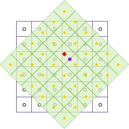
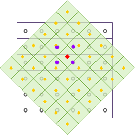
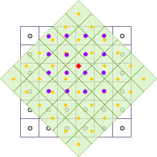
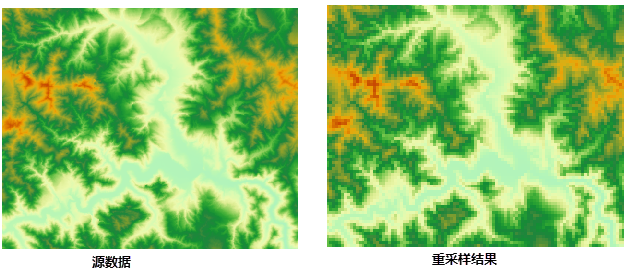

  
### 使用说明  

　　栅格重采样是将输入图像的像元值或推导值赋予输出图像中每个像元的过程。这里提到的图像为栅格数据，包括栅格（GRID）和影像（IMAGE）两类。当输入图像和输出图像的位置（经过几何变换或投影设置等操作）或像元大小（即栅格影像分辨率）发生变化时，都需要进行栅格重采样

　　此外，栅格重采样是栅格数据在空间分析中处理栅格分辨率匹配问题的常用数据处理方法，为了便于分析，通常将不同的分辨率通过栅格重采样转化为相同的分辨率。对于一个既定的空间分辨率的栅格数据，可以通过重采样操作，将栅格数据重采样成更大的像元，即降低空间分辨率。这个过程会丢失部分原高空间分辨率的细节信息；也可以重采样成更小的像元，但是并不会增加更多的信息。将低空间分辨率的多光谱遥感影像重采样成与高空间分辨率的全色影像相同的分辨率，然后对两个影像进行融合，得到的图像将同时具有高光谱分辨率和高空间分辨率的信息，可用于专题提取和应用，是常用的遥感数据融合方式。    
  
 　　栅格重采样主要包括三种方法：最邻近法、双线性内插法和三次卷积插值法。最邻近法是把原始图像中距离最近的像元值填充到新图像中；双线性内插法和三次卷积插值法都是把原始图像附近的像元值通过距离加权平均填充到新图像中。下面将详细介绍这三种重采样方法。

#### 最邻近法

最邻近法是将输入栅格数据集中最邻近的像元值作为输入值，赋予输出栅格数据集的相应像元。  

该方法的优点是不会改变原始栅格值，而且处理速度快，但是该方法会有半个像元大小的位移。适用于表示分类或某种专题的离散数据，如土地利用、植被类型等。  

  

如上图所示，为栅格数据经过平移和旋转等几何变换后，对输出栅格数据集进行重采样，采用最邻近法。其中，黑色线框表示输入栅格数据集，浅绿色填充表示输出栅格数据集，红色方点表示输出栅格数据集中某一像元的中心位置，其像元值将被重新计算。找到距离红色方点所在像元最近的像元的中心点，即图中所示紫色圆点，将紫色圆点所表示的像元值填充到红色方点中，完成一个栅格像元的重采样。

#### 双线性内插法
  
双线性插值法是基于三次线性插值的方法，将输入栅格数据集中的4个最邻近像元（4邻域）的像元值进行加权平均计算出新的像元值，并将其赋予输出栅格数据集的相应像元。其中，权值是由4邻域中每个像元的中心与内插点之间的距离决定的。
  
该方法的重采样结果会比最邻近法更平滑，但会改变原来的栅格值。适用于表示某种现象分布、地形表面的连续数据，如 DEM、气温或降雨量分布、坡度等，这些数据本来就是通过采样点内插得到的连续表面。

  

如上图所示，为栅格数据经过平移和旋转等几何变换后，对输出栅格数据集进行重采样，采用双线性内插法。其中，黑色线框表示输入栅格数据集，浅绿色填充表示输出栅格数据集，红色方点表示输出栅格数据集中某一像元的中心位置，其像元值将被重新计算。取红色方点周围的4个邻近点，这4个邻近点的中心点即图中紫色圆点表示的位置，通过对其进行距离加权平均计算，将计算结果填充到红色方点中，完成一个栅格像元的重采样。

#### 三次卷积内插法
  
与双线性内插法类似，三次卷积内插法是基于五次多项式插值的方法，将输入栅格数据集中的16个最邻近像元（16邻域）的像元值进行加权平均计算出新的像元值，并将其赋予输出栅格数据集的相应像元。其中，权值是由16邻域中每个像元的中心点与内插点之间的距离决定的。

三次卷积内插法通过增加邻近点来获取最佳插值函数，可以进一步提高内插精度，算法较为复杂，计算量大，处理时间较长。由于该方法使用16邻域进行加权计算，处理结果会更加清晰，栅格数据的边界会有锐化的效果。该方法同样会改变原来的栅格值，且有可能会超出输入栅格的值域范围。适用于航片和遥感影像的重采样。

  
  
如上图所示，为栅格数据经过平移和旋转等几何变换后，对输出栅格数据集进行重采样，采用三次卷积内插法。其中，黑色线框表示输入栅格数据集，浅绿色填充表示输出栅格数据集，红色方点表示输出栅格数据集中某一像元的中心位置，其像元值将被重新计算。取红色方点周围的16个邻近点，这16个邻近点的中心点即图中紫色圆点表示的位置。通过对其进行距离加权平均计算，将计算结果填充到红色方点中，完成一个栅格像元的重采样。

### 操作说明  

 1. 在工具箱的“数据处理”-“栅格”选项中，双击“重采样”，即可弹出“重采样”对话框。  
 2. 在“源数据”处选择要进行重采样的数据集。**注意**：栅格数据重采样不支持多波段影像数据。  
 3. 参数设置：  
 	- 采样模式：SuperMap 提供了三种栅格重采样方法：最邻近法、双线性内插法和三次卷积内插法，各种方法的具体说明请参见栅格重采样方法介绍。   
 	- 分辨率：设置输出栅格数据集的分辨率。默认分辨率与输入栅格数据集分辨率的2倍。   
 	- 列数：输出栅格数据集中像素的列数，不可手动修改，由“分辨率”参数控制。默认列数与输入栅格数据集的列数相同。   
 	- 行数：输出栅格数据集中像素的行数，不可手动修改，由“分辨率”参数控制。默认行数与输入栅格数据集的行数相同。  
 	 
 4. 设置结果数据集名称和所保存的数据源，单击“执行”按钮即可进行数据重采样。下图为使用最邻近法，将像元大小调整为500（原像元大小为80）的栅格重采样的效果图。

 
   
  

