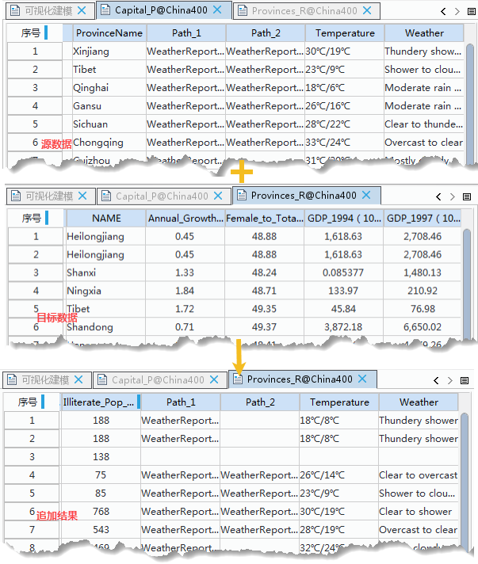

　　数据集追加列主要用于向目标数据集属性表中追加新的字段。该字段值来自于源数据集的属性表。

　　在操作过程中，需要设置一对连接字段，这对连接字段分别来自于源数据集和目标数据集，连接字段中具有相同的数据值时，才能完成数据值的顺利追加。

### 操作说明

 1. 在工具箱的“数据处理”-“矢量”选项中，双击“数据集追加列”，即可弹出“数据集追加列”对话框。
 2. 在“目标数据”处选择要追加属性的目标数据集，并设置与提供属性信息的源数据有对应关系的“连接字段”。
 3. 在“源数据”处选择提供属性字段信息的数据集，并设置与目标数据有对应关系的“连接字段”。
 4. 在“追加字段”处勾选需要追加到目标数据集的字段，双击“新字段名”单元格，可修改新字段名称。
 5. 设置好以上参数，单击“执行”按钮，即可执行“数据集追加列”的操作，结果如下图所示：  

  

### 注意事项

  - 源数据集必须具备目标数据集中所没有的字段，否则操作失败。 
  - 两个连接字段的字段名称可以不同，但字段类型必须相同且其中有相同的字段值。
  - 系统会过滤掉源数据集中与目标数据集已有字段相同的字段和系统字段及 SmUserID 字段，其余的用户字段会在“追加字段”列表框中会列出这些字段供选择。
  - 用于连接的字段其字段类型不能是二进制型。 
  - 用户字段是非系统字段及 SmUserID 字段的其它属性字段。
  - 对于 SQLPlus 数据源，目标数据集中若已存在数据且创建了图库索引，在追加操作完成后，建议对新产生的数据集手动删除图库索引，重新创建。 

### 相关主题

 [融合](Datafuse.html)

