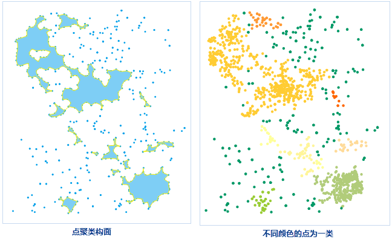

　　点密度聚类功能是指根据密度聚类的算法，将空间位置分布较为密集的点划分为一簇，或将同一簇点构成一个多边形。点聚类之后会在源数据集中生成一个“ResultType”字段，用于统计聚类类别信息。

**聚类原理**

　　对点集合进行空间位置的聚类，使用密度聚类方法 DBSCAN，它能将具有足够高密度的区域划分为簇，并可以在带有噪声的空间数据中发现任意形状的聚类。它定义簇为密度相连的点的最大集合。DBSCAN 使用点数目阈值和聚类半径（e）来控制簇的生成。其中，给定对象半径内的区域称为该对象的 e一邻域。如果一个对象的 e一邻域至少包含最小数目 MinPtS 个对象，则称该对象为核心对象。给定一个对象集合 D，如果 P 是在 Q 的 e一邻域内，而 Q 是一个核心对象，我们说对象 P 从对象 Q 出发是直接密度可达的。DBSCAN 通过检查数据中每个点的 e-领域来寻找聚类，如果一个点 P 的 e-领域包含多于 MinPts 个点，则创建一个以 P 作为核心对象的新簇，然后，DBSCAN反复地寻找从这些核心对象直接密度可达的对象并加入该簇，直到没有新的点可以被添加。

**应用场景**

　　该功能适用于大数据量的数据，应用于根据点的空间关系的亲疏程度进行分类，去除噪声点，也可将地理位置较紧密的一簇点构建为面对象，具体应用场景如下：

 1. 去除点云数据噪声点： 

　　在点云数据的获取时，会受到人为、仪器、环境、测量方法等因素的影响和干扰，获取到的点云数据中会含有噪声点。而获取到的被测物体的点云通常是沿表面连续分布的，噪声点一般位于点云外随机分布，因此，可通过点密度聚类功能，将噪声点去除。 

 2. 根据通讯信号的监测数据构建信号较弱的区域： 

　　通信监控系统会实时监控通讯信号的强度，可根据信号强弱情况，将信号低于某个强度的点提取出来，通过密度聚类功能构建信号较弱的区域，可作为新建信号塔选址的参考。
 

### 操作说明

 1. 在工具箱的“数据处理”-“矢量”选项中，双击“点聚类”，即可弹出“点聚类”对话框。
 2. 在“源数据”处选择要进行点密度聚类分析的数据集。
 3. 聚类半径：设置点密度聚类的半径，表示指定半径范围内，点的数目大于等于阈值时，则表示这些点为一个类别，即新增的 ResultType 属性值一样。半径单位可单击右侧下拉按钮进行设置。 
 4. 点数目阈值：用于显示和设置聚类为一簇的最少点个数，该值必须大于或等于2。阈值越大表示能聚类为一簇的条件越苛刻。推荐值为4。 
 5. 在结果数据处设置结果数据集名称，及所保存在的数据源，分析结果为一类的点会构造成一个面对象。
 6. 设置好以上参数之后，单击“执行”按钮，即可对指定的点数据集进行点聚类分析，执行成功后，输出窗口会有相应的提示，并提示聚类类别保存在数据集的字段名，得到的聚类结果如下图所示。图中未构成面的点即为离散点（噪声点），即右图中深绿色的点，其 ResultType 属性值为 0 。

  

### 相关主题

 [融合](Datafuse.html)

