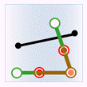
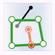
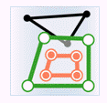
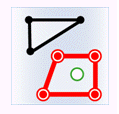
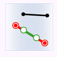
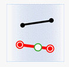
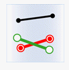
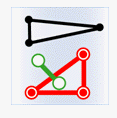
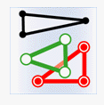
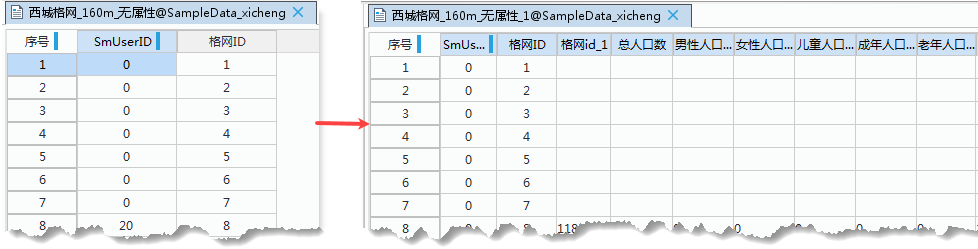

　　属性更新是指根据空间关系更新数据集中对象的属性。

### 使用说明

　　空间关系是指提供属性几何对象相对于目标几何对象的空间关系，包括包含、被包含、相交三种关系。

 - **包含**：提供属性数据集中几何对象包含目标数据集中几何对象。假设提供属性的数据集或记录集中的对象为 A，被更新的数据集或记录集中的对象为 B。若 A 包含 B，则对象 B 的属性将被对象 A 更新。如下图所示，绿色表示提供属性的对象，红色表示满足包含关系的被更新对象，黑色表示不满足该空间关系的对象。

 对象           | 目标点            |  目标线           |  目标面          
 :-------------- | :--------------- | :--------------- | :---------------
 提供属性的点  |    | 无 |无 
 提供属性的线  |    |  |无 
 提供属性的面  |    |  | 
 
　　被包含：提供属性数据集中几何对象被目标数据集中几何对象包含。 假设提供属性的数据集或记录集中的对象为 A，被更新的数据集或记录集中的对象为 B。若对象 A 被对象 B 包含，则对象 B 的属性将被对象 A 更新。如下图所示，绿色表示提供属性的对象，红色表示满足被包含关系的被更新对象，黑色表示不满足该空间关系的对象。

 对象           | 目标点            |  目标线           |  目标面          
 :-------------- | :--------------- | :--------------- | :---------------
 提供属性的点  |    |  |  
 提供属性的线  |  无 |  |  
 提供属性的面  | 无  | 无 | 

　　相交：提供属性数据集中几何对象与目标数据集中几何对象相交。假设提供

 对象           | 目标点            |  目标线           |  目标面          
 :-------------- | :--------------- | :--------------- | :---------------
 提供属性的点  |    |  |  
 提供属性的线  |    |  |  
 提供属性的面  |    |   | 

### 操作说明

 1. 在工具箱的“数据处理”-“矢量”选项中，双击“属性更新”，即可弹出“属性更新”对话框。
 2. 在“提供属性的数据”区域选择提供属性数据，并在“目标数据”处设置待更新属性的目标数据集。
 3. 保存统计信息：统计满足源数据集与目标数据集中指定空间关系的几何对象个数，将该信息保存在目标数据集中的某个整型字段里。 勾选“保存统计信息”然后选择一个字段用来存储更新对象的数量，可在文本框中直接输入字段名，若输入的字段不存在，则会新建一个字段，字段类型为32位整型。建议用户新建一个字段来存储该信息以免破坏原有数据。 
 4. 过滤表达式：单击右侧按钮，在弹出的“SQL表达式”对话框中设置字段过滤条件，更新属性时过滤掉目标数据集中符合表达式条件的对象，不将源数据集中的字段信息更新到这些对象属性中。 
 5. 选中对象：若在地图窗口中选中了几何对象，则“属性更新”对话框中会默认勾选“仅选中对象提供属性进行更新”复选框，表示只有选中的几何对象提供属性，注意：只能对一个数据集中的几何对象进行操作。 
 6. 设置“空间关系”，空间关系是指提供属性几何对象相对于目标几何对象的空间关系，有“包含”，“被包含”，“相交”三种关系。
 7. 边界处理：用于判定空间关系是否将面对象的边界归属于面内。可设置为面边界为面外、面边界为面内两种方式。 该组合框只有在需要进行面与点的包含关系判定时，或面与线的相交关系判定时才会被激活。 
   - 若选择“面边界为面内”，表示位于面边界上的点属于面所包含的点，线上的点与面相边界上的点重合时，表示面与该线相交。 
   - 若选择“面边界为面外”，表示位于面边界上的点不算面所包含的点，线上的点只与面边界上点重合而不位于面内，此时不算相交。 
 8. 设置“取值方式”，如果满足条件并可提供属性数据的对象有多个，则提供属性对象通过某种“取值方式”处理后赋给目标对象。 
   - 直接赋值：随机取其中一个的属性数据用于更新。该方式适合一对一赋值。 
   - 平均值：取其平均值用于更新。对数值类型的字段有效。 
   - 求和：取各个对象的属性和用于更新。对数值类型的字段有效。 
   - 最大值：取各个对象属性中最大的值用于更新。对数值类型的字段有效。 
   - 最小值：取各个对象属性中最小的值用于更新。对数值类型的字段有效。 
   - 最大SMID：取具有最大 SmID 的对象属性值用于更新。 
   - 最小SMID：则取具有最小 SmID 的对象属性值用于更新。 
 9. 在“字段设置”列表中勾选要进行数据更新的“提供属性字段”，在对应的“目标字段”中选中后再次单击，就可以选择需更新到的目标字段，或新建字段。 **注意**：该列表中显示的字段是经过系统过滤的，如果目标数据集中不存在与提供属性数据集中某个字段类型相匹配的字段，则该字段显示为空，可新建目标字段进行属性更新。
 10. “忽略系统字段”复选框用于设置是否忽略系统字段，若勾选该复选框则字段列表中不显示系统字段，若不勾选则显示系统字段。 
 11. 更新完成后，目标数据集属性表中的字段（新建或者已存在的字段）会更新源数据集中对应的字段值。 

  
  
### 注意事项

 - 在设置字段时，要求源字段与目标字段类型必须相同。字段类型不同无法进行赋值。 
 - 不同的统计方法需要对应不同的统计字段。直接赋值、最大 SMID 和最小 SMID 为数值类型或文本类型，不支持布尔类型、备注类型和日期类型。平均值、求和、最大值和最小值为数值型字段。 

### 相关主题

 [融合](Datafuse.html)

