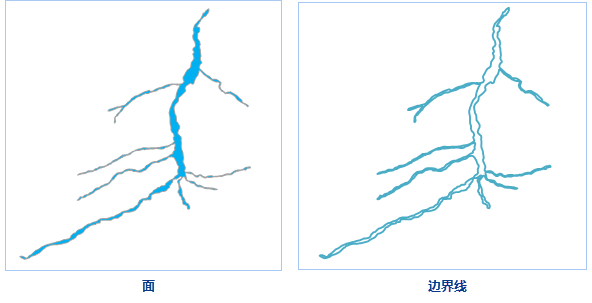

　　提取边界线就是将面对象的边界线提取出来，并将结果数据保存为线数据集。如果某条线同时存在左右多边形，则该条线为面对象的公共边界，只会被提取一次；如果只存在左或者右单个多边形，则该条线属于面数据集的外轮廓线。

### 操作说明

 1. 在工具箱的“数据处理”-“矢量”选项中，双击“提取边界线”，即可弹出“提取边界线”对话框。
 2. 在源数据处设置需提取边界线的面数据集。
 3. **拓扑预处理**：勾选该复选框，则在提取边界线之前对面数据集进行拓扑预处理操作，建议用户勾选“拓扑预处理”选项。此处的拓扑预处理会对面数据集进行线段间求交插入节点、调整多边形走向、在节点与线段间插入节点、捕捉节点四种方式处理。避免了假节点、冗余节点、悬线、重复线等错误数据的产生，提高了结果数据的质量、可用性。

 
 4. 设置好结果数据集之后，单击“执行”按钮，即可执行提取边界线操作，结果如下图所示：  

  

### 相关主题

 [融合](Datafuse.html)

