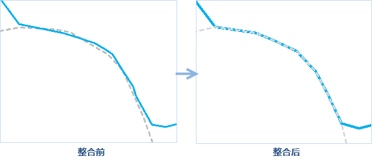

### 使用说明

　　整合是指将容限范围内的节点捕捉到一起，即把容限范围内的对象视为同一个对象或重叠对象。可用于处理对象公共边之间存在缝隙和重叠的问题。

 - 整合适用于点、线、面数据集。 
 - 整合会改变源数据，若想保留源数据，建议提前做好数据备份。 
 - 整合时会将捕捉在一起的节点修改为同样的二维坐标。 

### 操作说明

 1. 在工具箱的“数据处理”-“矢量”选项中，双击“整合”，即可弹出“整合”对话框。
 2. 在“源数据”处选择要进行融合的数据集。
 3. **整合容限**：整合时会把容限范围内的节点捕捉到一起，节点容限较大会导致要素重叠或导致面和线对象被删除，还可能导致不被期望移动的节点发生移动。所以，容限值应该尽量小。
 4. 单位：提供了多种容限单位，默认为米。
 5. 设置好以上参数后，单击“执行”按钮即可进行数据整合，结果如下图所示。

  

### 相关主题

 [融合](Datafuse.html)

