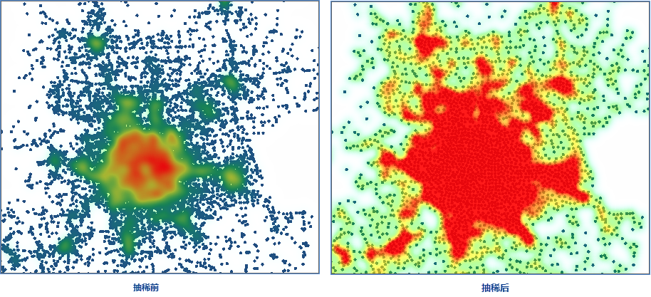

　　点抽稀功能是指根据指定的抽稀半径，以数据集中的一个点为中心，其圆内所有的点都会被抽稀，然后使用一个点表示所有点，抽稀后的点不一定是被抽稀点集的中心点，具有一定的随机性。

**应用场景**

　　可用于在小比例尺下制图，若点数据中的点较为密集，则在小比例尺下显示会存在相互压盖叠加显示的情况，通过该功能将点对象进行抽稀，可在体现点数据的整体信息的情况下，提高地图的性能和显示效果。 

### 操作说明

 1. 在工具箱的“数据处理”-“矢量”选项中，双击“点抽稀”，即可弹出“点抽稀”对话框。
 2. 在“源数据”处选择要进行抽稀的点数据集。
 3. **抽稀半径**：用于设置抽稀点的半径，表示在该半径圆范围内只随机保留一个点，半径越大则结果数据集中的点对象越稀疏。 
 4. **统计类型**：对抽稀半径范围内保留的结果点的原字段值，选取某种统计类型重新计算,在结果数据集中新增一个统计字段，将计算结果赋予该字段。支持的统计类型有8种，分别是：平均值、最大值、最小值、样本标准差、样本方差、标准差、方差、总和。 
   - 平均值：当统计类型为“平均值”时，统计字段的值即为抽稀半径范围内所有点的属性字段值的平均值。 
   - 最大值：当统计类型为“最大值”时，统计字段的值即为抽稀半径范围内所有点的属性字段值中的最大值。 
   - 最小值：当统计类型为“最小值”时，统计字段的值即为抽稀半径范围内所有点的属性字段值中的最小值。
   - 样本标准差：当统计类型为“样本标准差”时，统计字段的值即为抽稀半径范围内所有点的属性字段值的样本标准差。 
   - 样本方差：当统计类型为“样本方差”时，统计字段的值即为抽稀半径范围内所有点的属性字段值的样本方差。 
   - 标准差：当统计类型为“标准差”时，统计字段的值即为抽稀半径范围内所有点的属性字段值的标准差。 
   - 方差：当统计类型为“方差”时，统计字段的值即为抽稀半径范围内所有点的属性字段值的方差。 
   - 总和：当统计类型为“总和”时，统计字段的值即为抽稀半径范围内所有点的属性字段值的总和。 
 5. **随机保存抽稀点**：勾选随机保存抽稀点，从抽稀半径范围内随机取一点保存；否则取抽稀半径范围内点集中距离之和最小的点。 
 6. **保留原字段**：勾选后结果数据集中，会保留原数据的所有字段信息，若不勾选则只保留统计字段中勾选的字段。
 7. 设置好以上参数之后，单击“确定”按钮，即可对指定的点数据集进行抽稀，执行成功后，输出窗口会有相应的提示，并提示点抽稀的压缩率，得到的抽稀结果如下图所示，左图为抽稀之前的根据点数据集制作的热力图，可以看到点数据密集之处有压盖的现象，且热力图渲染效果不明显；右图为根据抽稀后的点数据集制作的热力图，相比左图点对象要稀疏一些，并且没有相互压盖的现象，且渲染效果较好。 

  

### 相关主题

 [融合](Datafuse.html)

