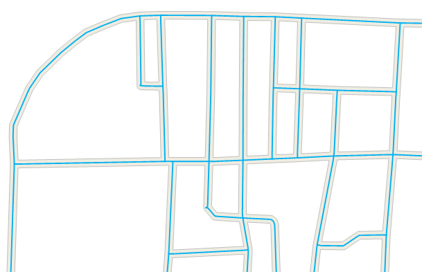

　　面主干中心线是指提取面数据集主干道面对象的中心线，即按面对象的最长距离进行提取，并将结果保存为线数据集，一般用于提取河流的主干中心线。

　　提取中心线时，默认按面对象的最长距离提取；同时，还可支持单独提取某个选中面对象的中心线，若提取的中心线范围未达到用户需求，可指定提取中心线的起点和终点。如果面对象中包含岛洞，提取时会绕过岛洞，并选择一条最短路径提取中心线。

### 操作说明

 1. 在工具箱的“数据处理”-“矢量”选项中，双击“面主干中心线”，即可弹出“面主干中心线”对话框。
 2. 在源数据处设置需提取主干中心线的面数据集，并设置结果数据集。
 3. 单击“执行”按钮，即可提取面数据的主干中心线，结果如下图所示：  

  

### 相关主题

 [融合](Datafuse.html)

