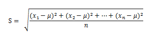
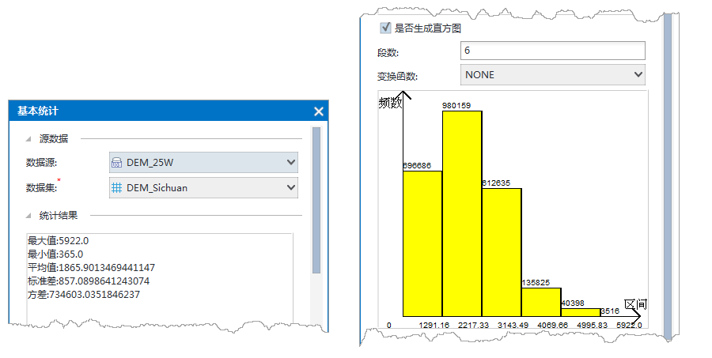

### 使用说明

　　根据输入的栅格数据计算每个像元的基本信息并进行相关统计，同时还可以通过直方图直观地查看统计结果以及灰度信息。统计的内容包括:最大值、最小值、平均值、标准差、方差。
  
### 操作说明

 1. 在工具箱的“栅格分析”-“栅格统计”选项中，双击“基本统计”，即可弹出“基本统计”对话框。
 2. 选择要进行统计的栅格数据，包括数据所在的数据源和数据集。  
 3. 单击“统计”按钮，对栅格数据进行统计。  
 4. 统计结果区域，显示基本统计的内容。包括最大值、最小值、平均值和标准差等。 

  - **最大值**：查找栅格像元值中的最大值。 
  - **最小值**：查找栅格像元值中的最小值。 
  - **平均值**：统计栅格数据中所有像元值的平均值。  
  - **标准差**：统计栅格数据中所有像元值的标准差。标准差是各个统计数据偏离平均数的距离的平均数，能够反映数据的离散程度。标准差是方差的算术平方根。如下面的公式所示，x1,x2,x3,......xn 为一组样本数据，µ 为其平均值，则标准差公式计算方法如下：   
  　　  
  - **方差**：统计栅格数据中所有像元值的方差。方差是各个统计数据源与其平均数的差的平方和。  

  5.**是否生成直方图**：勾选该复选框，即可生成栅格数据的直方图，所谓直方图又叫频率分布直方图，提供了栅格数据中的栅格值的频率分布图。每一个柱状条的面积代表了位于特定分区间或者某一分组内的相对频数。直方图中默认使用的等宽类数目。栅格直方图的横轴表示栅格值的分组，栅格值将被划分到这 N（默认为 100）个组中，即每个组对应着一个栅格值范围；纵轴表示频数，即栅格值在每组的值范围内的单元格的个数。

  - **段数**：输入一个正整数作为统计分析段数。
  - **变换函数**：即对字段值做变换处理的函数，系统提供了NONE（无函数，即不进行变换处理）、LOG（对数函数）、ARCSIN（反正弦函数）三种变换处理函数。变换函数在对样点数据进行插值的时候，有一些插值方法（比如普通克吕金、简单克吕金和泛克吕金等）都假设数据服从正态分布。如果样点数据不服从正态分布，需要先进行数据变换，从而使数据服从正态分布。三种变换处理函数说明如下：    
    - **None**：无函数，即不进行变换处理，使用原始数据进行插值。   
    - **Log**：对数函数，即对原始数据进行以自然对数为底的对数变换。对数变换适用于呈正偏分布，即峰值靠左，即中位数大于中值的样点数据。对数函数的定义域为大于0的实数，因此在进行 log 函数变化时，请保证满足该条件。   
    - **Arcsin**：反正弦函数，即对原始数据进行反正弦变换。反正弦函数适用于数据成比例或者按百分比分布的数据。此函数的定义域范围为[-1,1]，因此在进行反正弦函数变换时，请注意统计字段的取值范围。   
    
  6.单击“执行”按钮，即可执行统计操作。  

　　

### 相关主题

 [常用统计](CommonStatistic.html)  
 [邻域统计](NeighbourStatistic.html)    
 [区域统计](ZonalStatistic.html)    
 [高程统计](AltitudeStatistic.html)    

