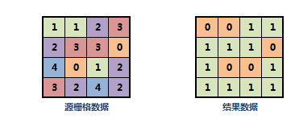
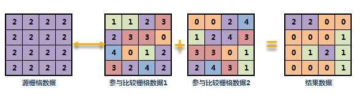

　　栅格常用统计，可以实现待统计栅格数据集与一个或多个栅格数据集或一个数字进行逐单元格的比较，按照比较条件进行统计。按照比较方式的不同，可以分为以下两种：    
  
-  **与固定值比较**：将一个栅格数据集逐行逐列按照某种比较方式与一个固定值进行比较，比较结果为“真”的像元值为1，比较结果为“假”的像元值为0。如下图所示：当固定值设为1，比较类型为“大于”，则像元值大于1的比较结果即为“真”，结果像元值为1。 
  

　    
  
-  **与其他栅格数据集比较**：将输入栅格值与其他一个或多个栅格数据集的对应像元值进行比较，比较结果为“真”的次数。如果与多个栅格数据集进行比较，则最终将两两比较的值进行加和；如下图所示，当比较类型为“大于”时，将参与比较的栅格数据1和栅格数据2，逐个像元的与源数据做比较，结果数据统计的是两两加和的次数。 该统计方式可用于将不同年份专题栅格数据进行统计比较，以统计不同年份的变化情况。

　    
 
  
### 操作说明

1. 功能入口有以下两种方式：
  - 在“空间分析”选项卡的“栅格分析”组中，单击“栅格统计”下拉按钮，选择“常用统计”选项。
  - 在工具箱的“栅格分析”-“栅格统计”选项中，双击“常用统计”，即可弹出“常用统计”对话框。或将该选项拖入可视化建模的画布中。
2. 选择要进行统计的栅格数据，包括数据所在的数据源和数据集。  
3. 设置统计参数。程序提供两种比较方式，与**固定值**和**栅格数据集**比较。根据不同的统计类型，需要设置以下参数：  
   
  - **比较类型**：两种比较方式都需要预先选择比较运行函数，包括等于运算、大于运算、小于运算、大于等于运算和小于等于运算。
  - **统计栅格与固定值进行比较时**：选中“固定值”单选按钮，固定值后面的文本框被激活，输入要比较的固定值大小。  
  - **统计栅格与其他栅格数据进行比较时**：选中“栅格数据集”单选按钮，激活栅格数据集后面的选择按钮，单击“选择”按钮，选择要进行统计的其他栅格数据集，可以是单个或者多个栅格数据集。  
  
 
4.设置是否忽略无值数据。默认忽略无值数据。选中该参数，在进行统计时，无值数据将不参与统计，否则统计过程中需要考虑无值数据。**注意**：将待统计栅格数据集与多个比较栅格数据集进行统计时，是否忽略无值将影响统计的结果，比较栅格数据集的数量影响结果栅格的像素格式和无值的值。    
  
  - **是否忽略无值**：当待统计栅格数据集中有无值栅格时，如果选择忽略无值，则统计结果栅格数据集中对应像元仍为无值，否则使用该无值参与比较；当比较栅格数据集中有无值栅格时，如果选择忽略无值，则此次比较不计入统计结果，否则使用该无值进行比较。  
  - **统计结果数据集中无值的值**：当无值不参与运算时（即忽略无值），统计结果数据集中无值的值，由结果栅格的像素格式决定，为可取的最大像元值，例如，结果栅格数据集像素格式为UBit8，即每个像元使用8个比特表示，则无值的值为255。在此方法中，结果栅格的像素格式是由比较栅格数据集的数量来决定的。比较数据集得个数、结果栅格的像素格式（参见下表）和结果栅格中无值的值三者的对应关系如下表：   
    
比较数据集的数量（n）|结果栅格的像素格式|结果栅格中无值的值  
-|-|-  
0＜n＜15|UBit4|15  
0＜n＜15|UBit8|255 
0＜n＜15|Bit32|-9999
   
5.设置统计结果参数，包括统计结果数据集所在的数据源和结果数据集名称。  
6.单击“执行”按钮，即可执行统计操作。   

### 相关主题

 [基本统计](BasicStatistic.html)   
 [邻域统计](NeighbourStatistic.html)    
 [区域统计](ZonalStatistic.html)    
 [高程统计](AltitudeStatistic.html)    

