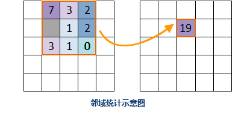

　　邻域统计是对数据集中的每个像元值的邻域范围内的像元进行统计，即以待计算栅格为中心，向其周围扩展一定范围，基于这些邻域范围内的栅格数据进行统计计算，将运算结果作为像元的值。目前提供的统计方法包括：最大值、最小值、众数、最少数等。常用的邻域范围类型包括：矩形、圆形、圆环和扇形等。下图为邻域统计的示意图，图中位于第二行第三列的单元格，它的值由其周围扩散得到的3*3（矩形邻域）的邻域内所有像元值来确定。  
        　　  
- **邻域形状类型**：邻域统计过程中，提供4种类型的邻域：矩形邻域、圆形邻域、环形邻域和扇形邻域，分别如下：   
 
    - **矩形**：矩形的大小由指定的宽度和高来确定，矩形范围内的像元参与邻域统计的计算。矩形邻域宽和高的默认值均为 0（单位为地理单位或栅格单位）。   
    - **圆形**：圆形邻域的大小根据指定的半径来确定，圆形范围内的所有像元都参与邻域处理（注意：只要像元有部分包含在圆形范围内都将参与邻域统计）。圆形邻域的默认半径为 3（单位为地理单位或栅格单位）。   
    - **圆环**：环形邻域的大小根据指定的外圆半径和内圆半径来确定，环形区域内的像元都参与邻域处理。环行邻域的默认外圆半径和内圆半径分别为3和6（单位为地理单位或栅格单位）。   
    - **扇形**：扇形邻域的大小根据指定的圆半径、起始角度和终止角度来确定。在扇形区内的所有像元都参与邻域处理。扇形邻域的默认半径为 3（单位为地理单位或栅格单位），起始角度和终止角度的默认值分别为0度和360度。   
    四种形状如下图所示，默认邻域大小为3*3。图上单元格仅为示意。
         
  
- 邻域统计的应用十分广泛。例如：对表示物种种类分布的栅格计算每个邻域内的生物种类，从而观察该地区的物种丰度；还可对坡度栅格统计邻域内的坡度差，从而评估该区域的地形起伏状况：

      

- 邻域统计还用于图像处理，如统计邻域内的平均值（称为均值滤波）或中位数（称为中值滤波）可以达到平滑的效果，从而去除噪声或过多的细节，等等。

  
### 使用说明  
  
 1. 功能入口有以下两种方式：
  - 在“空间分析”选项卡的“栅格分析”组中，单击“栅格统计”下拉按钮，选择“邻域统计”选项。
  - 在工具箱的“栅格分析”-“栅格统计”选项中，双击“邻域统计”，即可弹出“邻域统计”对话框。或将该选项拖入可视化建模的画布中。
 2. 选择要进行统计的源数据（栅格数据），包括栅格数据所在的数据源和数据集。  
 3. 设置邻域统计的相关参数，包括统计模式、单位类型和邻域形状。  
   - **统计模式**：选择使用的统计模式，一共有10种类型可选。包括最小值、最大值、平均值、标准差、和、种类、值域、众数、最少数和中位数。有关统计模式的详细说明请参看[区域统计](ZonalStatistic.html)。  
   - **单位类型**：选择进行统计时使用的单位类型。目前支持2种单位类型，包括栅格坐标和地理坐标。栅格坐标是指使用栅格数作为邻域单位；地理坐标是指用地图的长度单位作为邻域单位。  
   - **邻域形状**：选择邻域统计的形状。目前支持4种邻域形状，包括矩形、圆形、圆环和扇形。选定要使用的形状后，还需设置具体形状大小，例如对于矩形需要设置矩形的宽度和高度；对于扇形，需要设置扇形的半径、起始角度和终止角度。 
    
 4. 设置是否忽略无值数据。选中忽略无值数据时，统计时仅对值栅格数据中有值的像元进行统计；否则会对无值像元进行统计。  
 5. 设置结果数据。需要设置邻域统计结果数据要保存的数据源以及栅格数据的名称。   
 6. 单击“执行”按钮，即可执行统计操作。  

### 相关主题

 [基本统计](BasicStatistic.html)  
 [常用统计](CommonStatistic.html)    
 [区域统计](ZonalStatistic.html)    
 [高程统计](AltitudeStatistic.html)    

