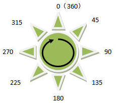
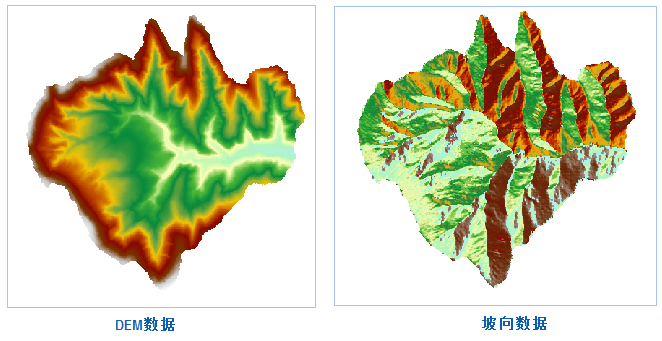

　　坡向分析用于计算栅格数据集（通常使用 DEM 数据）中各个像元的坡度面的朝向。坡向计算的范围是0到360°，以正北方0°为开始，按顺时针移动，回到正北方以360°结束。平坦的坡面没有方向，赋值为-1。

### 分析原理

　　地表面某一点的坡向表示经过该点的斜坡的朝向。在地形分析中，坡向表示经过地表某一点的切平面的法线在水平面的投影与经过该点正北方向的夹角。坡向表示该点高程值改变量的最大变化方向。

　　坡向用度数表示，坡向分析结果的范围是0到360°。以正北方0°为开始，按顺时针移动，回到正北方以360°结束。坡度图中每个像元的值代表了其像元面的斜坡面对的方向，平坦的坡面没有方向，赋值为-1。

　　

　　由于坡向是圆的度量，10°坡向比30°坡向更靠近360°。因此，用坡向做数据分析之前，用户需要对坡向进行转换，即：将坡向分为东、西、南、北4个基本方向（或者东、西、南、北、东南、西南、东北、西北8个基本方向），可通过栅格重分级功能完成转换，突出需要考虑的坡向范围。

### 应用场景

　　坡向在植被分析、环境评价等领域有重要的意义。
  - 在生物学上，生长在朝向北的斜坡上和生长在朝向南的斜坡上的植被一般有明显的差别，这种差别的主要原因在于绿色植被生长需要阳光的充分程度不同；
  - 建立风力发电站的选址时，需要考虑把它们建在面向风的斜坡上；
  - 地质学家经常需要了解断层的主要坡向，或者褶皱露头，来分析地质变化的过程；
  - 在确定容易被积雪融水破坏的居民区的位置时，需要识别朝南的坡面，来得到最初融化的积雪的位置。

### 操作说明

 1. 在工具箱的“栅格分析”-“表面分析”-“地形计算”选项中，双击“坡向分析”，即可弹出“坡向分析”对话框。
 2. 在源数据处设置要进行坡度分析的栅格数据集，通常我们会选择拥有高程值的 DEM 数据。
 3. 设置结果数据所要保存的数据源，及结果数据集的名称，坡度数据集是与源数据集等大且分辨率相同。
4. 单击“执行”按钮，即可执行坡向分析操作，结果如下图所示：

　　

### 相关主题

　　 [填挖方](CutFill.html)

　　 [面填挖方](CutFillRegion.html)

　　 [反算填挖方](InverseCutFill.html)

　　 [查找极值](FindExtreme.html)

　　 [DEM曲率计算](CalculateCurvature.html)

　　 [坡度分析](Slope.html)

　　 [剖面分析](Profile.html)

　　 [正射三维影像](OrthoImage.html)

　　 [三维晕渲图](HillShade.html)

