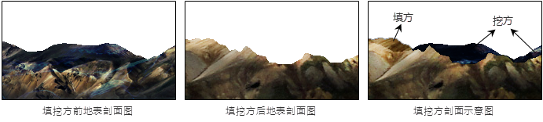
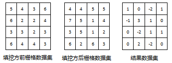
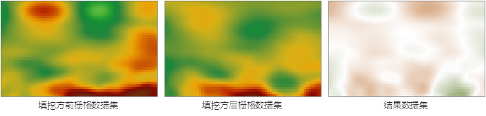
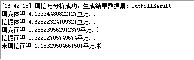

### 填挖方原理

　　地表经常由于沉积和侵蚀等作用引起表面物质的迁移，表现为地表某些区域的表面物质增加，某些区域的表面物质减少。在工程中，通常将表面物质的减少称为“挖方”，而将表面物质的增加称为“填方”。将一种情况变为另一种情况时需要填/挖的面积和大小。下图为填挖方的地形剖面示意图。

  

　　栅格填挖方计算要求输入两个栅格数据集：填挖方前的栅格数据集和填挖方后的栅格数据集，生成的结果数据集的每个像元值为这两个输入数据集对应像元值的变化值。如果像元值为正，表示该像元处的表面物质减少；如果像元值为负，表示该像元处的表面物质增加。如下图所示，以一个4*4的栅格数据显示了填挖方的计算方法：

  

　　通过该图可以看出：结果数据集 = 填挖方前栅格数据集 - 填挖方后栅格数据集。

　　下图所示为填挖方结果示意图，分别列出了填挖方之前的源数据集、作为参考的填挖方数据集和生成的填挖方结果数据集。源数据集和填挖方数据集中，高程值越高，栅格颜色偏向棕红色；高程值越低，栅格颜色偏向绿色。在填挖方结果数据集中，需要挖方的部分用墨绿色表示，且挖方量越大，颜色越深；需要填方的部分用棕色表示，且填方量越大，颜色越深；不需要填挖方的部分用白色表示。

  

　　当然，填挖方是对两个输入数据集对应像元的计算，这就需要两个输入数据集有相同的坐标和投影系统，以保证同一个地点有相同的坐标，如果两个输入数据集的坐标系统不一致，则很有可能产生错误的结果。理论上，要求两个输入数据集的空间范围也是一致的，然而，对于空间范围不一致的两个输入数据集，只计算其重叠区域的表面填挖方的结果；另外，在其中一个数据集的像元为空值处，计算结果该像元值也为空值。

　　此外，对于空间范围不一致的两个数据集的填挖方操作的结果的数据集的范围与两个数据集的重叠区域的范围一致。

　　填挖方用来统计一个地形表面所需要挖方或者填方的土方量。一种是通过统计两个栅格数据（源数据和填挖方数据）之间的体积和面积变化实现填挖方，

　　填挖方结果得到一个新的栅格数据集，实际是源栅格数据集和挖方对象之间栅格代数运算的结果，并对发生变化的区域进行统计的结果。

### 操作说明

 1. 在工具箱的“栅格分析”-“表面分析”-“地形计算”选项中，双击“点填挖方”，即可弹出“填挖方”对话框。
 2. 分别设置填挖方前和填挖方后的栅格数据集，以及结果数据集名称，对于输入的两个栅格数据集及结果数据集有几点内容需要注意：

  - 要求两个输入的栅格数据集有相同的坐标和投影系统，以保证同一个地点有相同的坐标，如果两个输入的栅格数据集的坐标系统不一致，则很有可能产生错误的结果。 
  - 理论上，要求输入的两个栅格数据集的空间范围也是一致的。对于空间范围不一致的两个栅格数据集，只计算其重叠区域的表面填挖方的结果。 
  - 若参与计算的一个栅格数据集某处的像元值为空值，则结果数据集中该处像元值也为空值。

 3. 单击“执行”按钮，即可执行填挖方操作。 执行完毕后会在输出窗口显示填挖方计算结果，包括填充体积、挖掘体积、填充面积、挖掘面积、未填挖面积5项内容，其中体积单位为立方米、面积单位为平方米。如下图所示：

　　

### 相关主题

　　 [面填挖方](CutFillRegion.html)

　　 [反算填挖方](InverseCutFill.html)

　　 [查找极值](FindExtreme.html)

　　 [DEM曲率计算](CalculateCurvature.html)

　　 [坡度分析](Slope.html)

　　 [坡向分析](Aspect.html)

　　 [剖面分析](Profile.html)

　　 [正射三维影像](OrthoImage.html)

　　 [三维晕渲图](HillShade.html)

