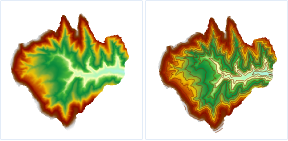

　　提取指定等值线可以按照用户的需要提取一定数量的特定值的等值线。可以直接输入特定值，也可以根据设置的范围和间隔自动生成系列特征值，还可以通过导入的方式，将存放在*.txt 文件中的特定值导入。

### 操作说明

 1. 在工具箱的“栅格分析”-“表面分析”-“提取等值线/面”选项中，双击“提取指定等值线”，即可弹出“提取指定等值线”对话框。
 2. 单击对话框中的按钮，弹出“批量添加栅格值”对话框，设置等值线的起始值、终止值、等值距、等值数等参数，单击“确定”按钮，返回“提取指定等值线”对话框。

   -  起始值：生成等值线的初始起算值。
   -  终止值：生成等值线的最大值。
   -  间距：设置相邻两条等值线之间的间隔值，确定间距后，软件会自动计算段数。
   -  段数：目标数据集中等值线的总数量。等值距确定后，系统会自动计算出等值数。
   -  自动重新计算终止值：设置间距后，可勾选“自动重新计算终止值”，即可根据起始值和间距重新计算终止值。

这里将起始值设置为1100，终止值设置为1200，等值距设置为20，表示提取1100-1200之间距离为20的6条等值线。

 3.在源数据处设置需提取等值线的栅格数据集，设置好之后软件会自动显示数据集栅格的最大值和最小值。
 
 4.**重采样系数**：与提取等值线时的重采样距离有关。重采样距离等于重采样系数与栅格数据集的分辨率之积。通过该参数来控制提取等值线时采样的控制点个数。推荐取值为 0～1倍的栅格分辩率，默认为0。该参数值越大，等值线的控制点越少。

 5.**光滑方法**：等值线的生成是通过对原栅格数据进行插值，然后连接等值点得到，所以得到的结果是棱角分明的折线，需要进行一定的光滑处理以模拟真实的等值线。

 6.**光滑系数**：B 样条法和磨角法都是随着光滑系数的增大而使提取的等值线越光滑，当然光滑系数越大，计算所需的时间和占用的内存也就越大。光滑系数的取值范围为[0,5]。取值为0或1表示不进行光滑处理，一般推荐光滑系数设为3。

 7.设置好结果数据集之后，单击“执行”按钮，即可执行提取所有等值线操作，结果如下图所示：  

  

### 相关主题

 [融合](Datafuse.html)

