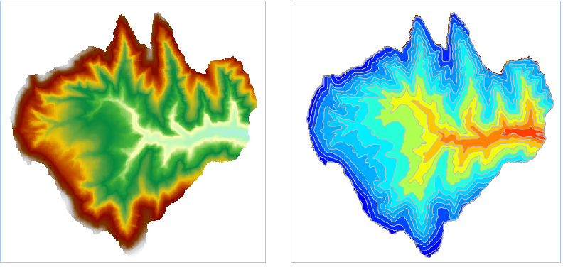

　　提取所有等值面通过指定参数提取表面模型中所有的符合条件的等值面。用于提取等值面的源数据集必须为 DEM 或 Gird 数据集。

### 操作说明

 1. 在工具箱的“栅格分析”-“表面分析”-“提取等值线/面”选项中，双击“提取所有等值面”，即可弹出“提取所有等值面”对话框。
 2. 设置提取等值面的公共参数，包括源数据、目标数据和参数设置中的基准值、等值距、重采样系数、光滑方法、光滑系数，公共参数的设置请参见[提取等值线/面](DriveContour.html)页面。
 3. **结果信息**： 参数设置完成后，系统会自动计算出结果信息并显示出来。结果信息的说明如下：

   - 栅格最大值：所选源数据集中最大的栅格值，为系统信息，不可更改。
   - 栅格最小值：所选源数据集中最小的栅格值，为系统信息，不可更改。
   - 最大等值线：目标数据集中等值面的最大值。
   - 最小等值线：目标数据集中等值面的最小值。
   - 等值数：目标数据集中等值面的总数目。

 4. 设置好结果数据集之后，单击“执行”按钮，即可执行提取所有等值面操作，结果如下图所示：  

  

### 相关主题

 [提取等值线/面](DriveContour.html)

 [提取所有等值线](DriveContourAll.html)

 [提取指定等值线](DriveContourSpecific.html)

 [点数据提取等值线](ExtractIsoline.html)

 [提取指定等值面](DriveRegionSpecific.html)

