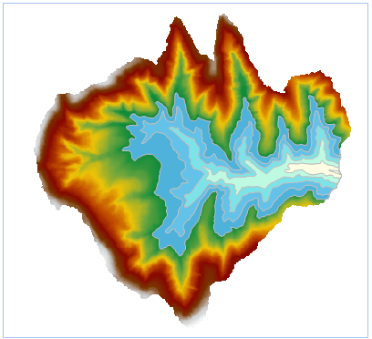

　　提取指定等值面可以按照用户的需要提取一定数量的特定值的等值面。可以直接输入特定值，也可以根据设置的范围和间隔自动生成系列高程值，还可以通过导入的方式，将存放在*.txt 文件中的特定值导入。

### 操作说明

 1. 在工具箱的“栅格分析”-“表面分析”-“提取等值线/面”选项中，双击“提取指定等值面”，即可弹出“提取指定等值面”对话框。
 2. 单击对话框中的按钮，弹出“批量添加栅格值”对话框，设置等值面的起始值、终止值、间距、段数等参数，单击“确定”按钮，返回“提取指定等值面”对话框。

   -  起始值：生成等值面的初始起算值。
   -  终止值：生成等值面的最大值。
   -  间距：选中该单选框，设置相邻两个等值面之间的间隔值，确定间距后软件会自动计算段数。
   -  段数：选中该单选框，设置目标数据集中等值面的总数量。等值距确定后软件会自动计算出等值数。
   -  自动重新计算终止值：设置间距后，可勾选“自动重新计算终止值”，即可根据起始值和间距重新计算终止值。
 3. 在源数据处设置需提取等值面的栅格数据集，设置好之后软件会自动显示数据集栅格的最大值和最小值。
  - 栅格最大值：所选源数据集中最大的栅格值，为系统信息，不可更改。
  - 栅格最小值：所选源数据集中最小的栅格值，为系统信息，不可更改。
 4. 设置提取等值面的公共参数，包括源数据、目标数据和参数设置中的基准值、等值距、重采样系数、光滑方法、光滑系数，公共参数的设置请参见[提取等值线/面](DriveContour.html)页面。
 5. 设置好结果数据集之后，单击“执行”按钮，即可执行提取指定等值面操作，结果如下图所示：  

  

### 相关主题

 [提取等值线/面](DriveContour.html)

 [提取所有等值线](DriveContourAll.html)

 [提取指定等值线](DriveContourSpecific.html)

 [点数据提取等值线](ExtractIsoline.html)

 [提取所有等值面](DriveRegionAll.html)
