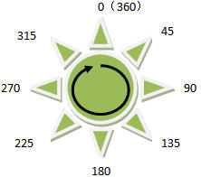
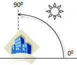
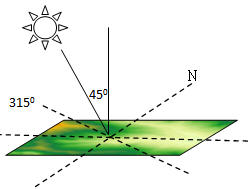
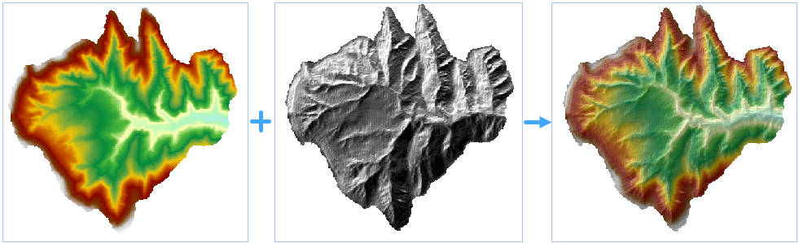

　　三维晕渲图是通过模拟实际地表的本影与落影的方式反映地形起伏状况的栅格图。通过采用假想的光源照射地表，结合栅格数据集得到的坡度坡向信息，得到各像元的灰度值，面向光源的斜坡的灰度值较高，背向光源的灰度值较低，即为阴影区，从而形象表现出实际地表的地貌和地势。由于栅格数据计算得到的这种山体阴影图具有非常逼真的立体效果，因此一般又称为三维晕渲图。

　　三维晕渲图在描述地表三维状况和地形分析中都具有比较重要的价值，当将其他专题信息叠加在三维晕渲图之上时，将会更加提高三维晕渲图的应用价值和直观效果。

　　三维晕渲图主要是用于显示。通过将栅格与三维晕渲图叠加，然后对栅格图层的透明度进行设置，可以轻松地创建出精美细致颇具立体感的地貌图。不同的应用场景下，为了达到最佳的制图效果，需要不断调整参数，例如栅格图层的透明度和亮度。之后可以在其上继续添加其他图层（如土地利用类型图、道路、河流图层），可进一步丰富地图信息。

### 原理

　　在生成三维晕渲图时，需要指定假想光源的位置，该位置是通过光源的方位角和高度角来确定的。

   - **方位角**是用来确定光源的方向，是用角度来表示的。如下图，以正北方向为0度开始，沿顺时针方向测量，从0度到360度来给各方向赋角度值，因而正北方向也是360度。正东方向为90度，正南方向为180度，正西方向为270度。方位角的默认值采用315度。 

   

   - **高度角**是光源照射时倾斜角度，范围是从0度到90度，如图所示，当光源高度角为90度时，光源正射地表。高度角的默认值采用45度。 

   

　　当光源的方位角为315度，高度角为45度时，其与地表的相对位置如下图 所示：

   

### 操作说明

 1. 在工具箱的“栅格分析”-“表面分析”-“地形计算”选项中，双击“三维晕渲图”，即可弹出“三维晕渲图”对话框。
 2. 在源数据处待生成正射三维影像的栅格数据集。
 3. **方位角**：方位角由0-360度之间的正度数表示，以北方向为基准方向按顺时针进行测量。 
 4. **高度角**：高于地平线的光源高度角。高度角由正度数表示，0度表示地平线，90度表示头顶正方向。 
 5. **阴影模式**：三维晕渲图有三种类型：渲染阴影效果、渲染效果和阴影效果。 
   - **渲染和阴影**：同时考虑当地的光照角及阴影的作用。
   - **阴影**：只考虑当前区域是否位于阴影中。
   - **渲染**：只考虑当地的光照角。
 6. **高程缩放倍数**：栅格表面中，栅格高程值（Z 值）相对于 X 和 Y 坐标的单位变换系数。当 Z 方向的单位与栅格表面的 X，Y 单位不同时，可使用高程缩放倍数进行调整。 

  - 如果 X，Y 单位与 Z 单位相同，则高程缩放系数为1，表示不缩放。
  - 如果 X，Y 单位与 Z 单位使用不同的测量单位，则必须使用适当的高程缩放系数，否则可能会得到错误的结果。例如，X，Y 方向上的单位是米，而Z方向的单位为英尺，由于1英尺=0.3048米，则需要制定高程缩放系数为0.3084，将英尺单位转换为米。

 7. 设置结果数据的名称和保存在的数据源，单击“执行”按钮，即可生成晕渲图，生成三维晕渲图的结果如下图所示，左图为原始栅格数据，中间为三维晕渲图，右图为晕渲图与栅格图层（透明度40%）叠加的显示效果。
 
　　 

### 相关主题

　　 [填挖方](CutFill.html)

　　 [面填挖方](CutFillRegion.html)

　　 [反算填挖方](InverseCutFill.html)

　　 [查找极值](FindExtreme.html)

　　 [DEM曲率计算](CalculateCurvature.html)

　　 [坡度分析](Slope.html)

　　 [坡向分析](Aspect.html)

　　 [剖面分析](Profile.html)

　　 [正射三维影像](OrthoImage.html)

