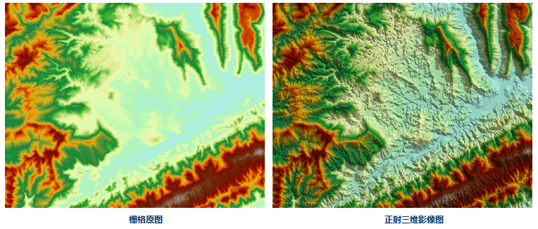

　　在拍摄航空影像过程中，无法保证任何拍摄瞬间相机都是绝对水平的，因此得到的影像可能发生倾斜；另外由于成像方式存在的固有误差，需要对影像进行纠正，从而消除各种变形。正射影像实质就是采用数字微分纠正技术，通过周边邻近栅格的高程得到当前点的合理日照强度，进行正射影像纠正的过程。经过纠正后的影像就是正射三维影像。

　　三维正射影像具有明显的立体效果，对于表达区域地形状况具有良好的效果，便于了解山区地形的特点。与其他专题信息叠加，能够帮助我们进行各种空间分析，如选址。由DEM生成的正射三维影像，能够达到一定的三维地形视觉效果。

### 操作说明

 1. 在工具箱的“栅格分析”-“表面分析”-“地形计算”选项中，双击“正射三维影像”，即可弹出“正射三维影像”对话框。
 2. 在源数据处待生成正射三维影像的栅格数据集。
 3. 无值颜色：生成的影像数据集中，无值数据的显示颜色。
 4. 颜色表：为生成的正射影像设置颜色表。 
 5. 创建剖面采样点数据集：勾选该复选框，则在生成剖面线的同时，会自动创建剖面采样点数据集；否则不会创建剖面采样点数据集。
 6. 单击“执行”按钮，即可生成正射三维影像结果如下图所示，左图为原始栅格数据，右图为正射三维影像。
 

### 相关主题

　　 [填挖方](CutFill.html)

　　 [面填挖方](CutFillRegion.html)

　　 [反算填挖方](InverseCutFill.html)

　　 [查找极值](FindExtreme.html)

　　 [DEM曲率计算](CalculateCurvature.html)

　　 [坡度分析](Slope.html)

　　 [坡向分析](Aspect.html)

　　 [剖面分析](Profile.html)

　　 [三维晕渲图](HillShade.html)
